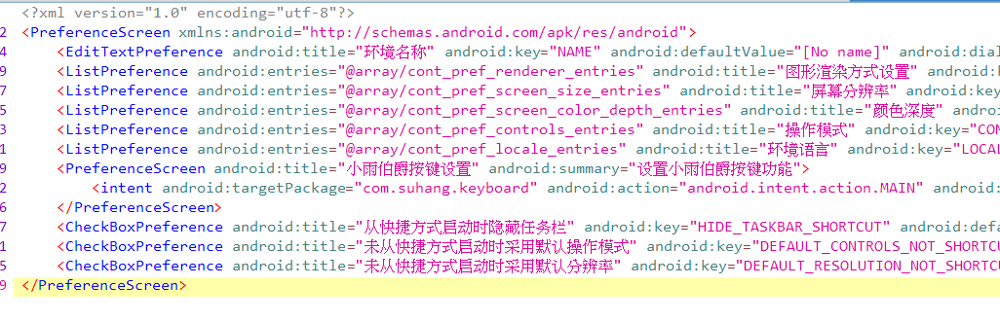

[[TOC]]

视频演示：
[【安卓Exagear】添加自定义分辨率功能，同时保证原预设分辨率可正常选择](https://www.bilibili.com/video/BV1BG4y1p7T6)
<iframe src="//player.bilibili.com/player.html?aid=816524122&bvid=BV1BG4y1p7T6&cid=862695941&page=1" scrolling="no" border="0" frameborder="no" framespacing="0" allowfullscreen="true"> </iframe>

## 前言
之前简单改过一次，就是把apk/res/xml/container_prefs.xml修改一下，这个是偏好设置的布局，加一个EditPreference就行了，但是原有的ListPreference会无法使用（闪退）。所以这次花了点时间写了个dialog，将两者兼容了。

## 使用现成代码添加该功能
先提供一下[现成smali代码](https://wwn.lanzout.com/iEcpl0dxmyqj)，用mt管理器的dex编辑器++功能，长按任意包名导入zip即可。
注意：
- ContainerSettingFragment这个类是原本就有的，需要先删掉再导入。
- 代码里包名是鲁大师，需根据实际情况自行修改。
- 如果确保操作无误，修改后依旧闪退，检查apk的arsc/array.xml，有个叫cont_pref_screen_size_values的，第一项应该是default小写的d，如果是大写貌似就会闪退。我懒得改代码了所以请手动改一下arsc吧=-=

实际上是添加了一个函数和两个成员变量，不过直接导入类更省事点，理论上是通用于ed版的吧。里面用到了两个资源id，一般也不用注意。

## 编写思路
### exa的布局
ex里用的是ContainerSettingsFragment 继承了PreferenceFragmentCompat，设置界面直接从xml创建，而且不用设置id，非常方便。



xml为apk/res/xml/container_prefs.xml，如果想要手动输入分辨率，添加一条EditTextPreference，key是SCREEN_SIZE。但是这样有个问题，就是没法再从list里选了，会闪退。
如果想改一些list中的预设的分辨率，可以去arsc的array里改，虽然dex里GuestContainerConfig类也有那个分辨率的字符串，不过好像只有在复制容器和启动容器的一个通常不会进入的分支里用到，所以不用改。

### 自定义preference类
本来想继承ListPreference然后加一项的，结果发现不会改，放弃。

### 修改弹出的dialog
发现可以在xml里设置dialogLayout属性，可惜只能加到dialog原有内容的下面，无法替换掉或修改原有内容。

在搜如何自定义dialogPreference时搜到了这个 [自定义DialogPreference](http://i.lckiss.com/?p=386)，发现如果要修改点击偏好选项弹出的弹窗的内容，其实在onDisplayPreferenceDialog里劫持一下然后自定义显示一个dialog就行了。。。虽然不太好，但是简单（ 
## 编写代码
在fragment里重写onDisplayPreferenceDialog方法。
- 设置一个switch开关用于选择是否使用自定义分辨率，开启时无法选择预设分辨率
	- 禁用radiogroup：没法直接禁用，需要给其每个button设置  https://blog.csdn.net/qq_31028313/article/details/90400547
	- 禁用edittext：我是用的setEnable(false)
- 声明变量curResolution 记录本次dialog期间最后选择的单选项，用于关闭时写入pref
	- 由于需要在监听中调用，监听用到内部类，所以要写成全局变量了
- 设置监听，点击单选项时，记录所选的对应的值
- 点确定关闭dialog时，如果禁用自定义就将记录的值写入，如果开启则先检查宽高是否都填写（开头先选一下单选项）
- 初始时从pref读取分辨率，并for循环查找是否为预设分辨率，是则禁用自定义分辨率并选中单选项，如果查到最后一个还不是则启用自定义分辨率并填入宽高（**记得测试一下点开为自定义的情况）**
- 测试发现summary那里自定义的话没法正常显示了，还得改一下updatePreference()，判断如果是screen_size的话，summary填xml中记录的value


----
编译成smali之后加到exa的dex中，需要修改：
- lamda不缩写，编译，把三个内部类加上，
- 复制那个新的方法onDisplayPreferenceDialog到ContainerSettingsFragment中
	- 包名可能要改成鲁大师
	- 那两个数组的资源id要改，entries是0x7f030006，values是0x7f030007（同时有个    const/high16要改成const)
- 开头添加成员变量curResolution和TAG
	```
	.field private static final TAG:Ljava/lang/String; = "ContainerSettingsFragment"
	.field curResolution:Ljava/lang/String;
	```
- 替换整个updatePreference方法

改起来还挺麻烦的，不如改好直接发整个fragment的smali。。。
## 总结
android提供了Preference的Fragment预设界面，只需要编写简单的xml，就可以使用预设的图形化界面进行偏好设置，非常便捷。

然而如果要修改预设就很麻烦了。。修改ListPreference这种 点击后出现的弹窗界面，有个简单的办法就是在fragment里重写onDisplayPreferenceDialog方法。