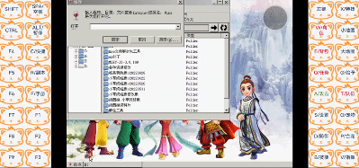
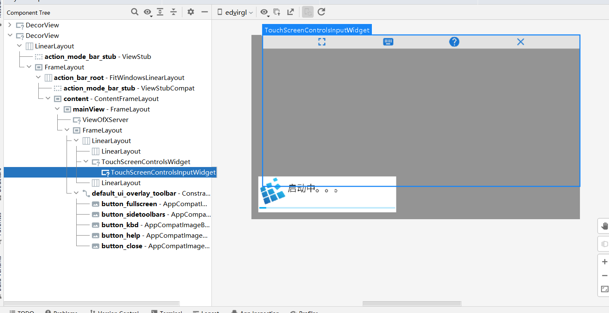

:::tip
- 若只想知道怎么解决，请从[解决方案-动手操作](./#解决方案-动手操作)开始看
- 本文章全部内容和解决办法均基于exagear，不保证其他应用可以解决
- 由于没有安卓12设备，只能在android12虚拟机上模拟exagear的窗口设置和调出键盘过程，所以无法保证所有安卓12手机均能此用方法解决问题
:::

请群友录制的视频。下图是安卓12键盘闪退的演示\


下图是修复后的调出键盘演示\

## 问题描述
- 从安卓11开始，游戏键盘gamekeyboard就出现问题，无法通过音量键调出了。在某些界面是可以调出的，但是在另外一些界面（比如需要键盘的植物大战僵尸tv版，或者exagear）就无法调出。对于游戏键盘的解决方法，可以看另一篇文章[解决安卓11和12无法通过音量键+调出游戏键盘](/blogs/2022/autumn/gamekeyboardOnAndroid12/)。本篇主要讲exagear。
- exa在安卓11还好点，虽然无法通过音量键+调出游戏键盘，但是在操作模式cp0（无键盘）和cp1（RTS）的顶栏，点击显示键盘图标，或者cp2往上的四指触屏-显示键盘还是可以调出游戏键盘或者手机输入法的。
- exa在安卓12上，调出键盘就没那么容易了。在安卓11的bug的基础上，cp2往上点击“显示键盘”后，键盘会弹出并立刻关闭。解决办法是疯狂点击“显示键盘”，手速够快的话键盘就能正常显示了（听起来有点离谱但确实可以）


## 推测问题原因
- 那么cp0 cp1和cp2往上有什么区别呢，发现两者调出键盘的方式略有不同，观察这两种操作模式的布局结构，cp01需要点击顶栏的键盘图标，而顶栏是包含在当前activity的布局内的。cp2往上需要四指触屏调出弹窗菜单popupMenu，点击菜单项“显示键盘”，而这个弹窗菜单是单独的一个decorview，不包括在当前activity的布局内。而当点击菜单项后，弹窗菜单消失，弹窗菜单所属的decorview也一起消失。\
两种布局结构如下图所示\

- 猜测，弹窗菜单由于不包括在当前acitivity的布局内，导致键盘显示异常。
- 设想解决办法：将弹窗菜单放到当前布局内。（最后解决办法：等弹窗菜单消失再延迟触发调出键盘）

## 查找问题原因

最后的解决办法和设想的有点出入，解决后也懒得再排查其他情况了，在这里仅简单记录一下查找过程。
1. 先是准备修改游戏键盘，然后发现改键盘只能解决音量键+调出bug，exa调出其他键盘还是会闪退。\
在这个期间看到了输入法有个报错
    ```
    Unexpected null in startExtractingText : mExtractedText = null, input connection = InputConnectionWrapper{idHash=#721e24 mMissingMethods=}
    ```
    搜了老长时间，一无所获，最后找到源码，也没能发现是什么问题（看源码对于我来说还是太难了），实际上最后的最后发现这个报错貌似和闪退没啥关系（
2. 然后找ex里调出键盘的方法，togglesoftinput。模拟ex的窗口设置（隐藏状态栏啥的），然后测试普通按钮可以调出，弹窗菜单PopupMenu就会闪退。和安卓12exagear的情况一样。打开as的logcat，选择no-filter，看到两条警告。猜测意思是：由于从菜单项点开的键盘，键盘挂载到弹窗菜单的窗口上，但是点击菜单项后弹窗菜单就消失了，导致输入法有点懵，也跟着一起关掉了。
	```
	system_process W/InputManager-JNI: Input channel object 'c66cd8c PopupWindow:3ebee5 (client)' was disposed without first being removed with the input manager!
	com.example.datainsert W/InputEventReceiver: Attempted to finish an input event but the input event receiver has already been disposed.
	```
3. 查看inputMethodManager除了toggle还有什么方式调出键盘，准备改成showsoftinput，结果普通按钮都调不出键盘。logcat找到一条警告
`W/InputMethodManager: Ignoring showSoftInput() as view=xxx is not served.`。意思是view不行？查看show的方法介绍，发现show传入的视图View必须是focus的，找了半天发现压根找不到带focus的，心累。弹窗菜单不行，菜单项不行，甚至getdecorview()获取到最顶层的view再findFocus()直接给我返回null
4. 遂谷歌，找到源码，发现这句警告的下一句debug输出"showSoftInput() view=..."以前在toggle的时候好像见过，也就是说如果正常显示键盘的话，那么就会显示这个输出。
    ```java
    //...
    checkFocus();
            synchronized (mH) {
                if (!hasServedByInputMethodLocked(view)) {
                    Log.w(TAG, "Ignoring showSoftInput() as view=" + view + " is not served.");
                    return false;
                }
                // Makes sure to call ImeInsetsSourceConsumer#onShowRequested on the UI thread.
                // TODO(b/229426865): call WindowInsetsController#show instead.
                mH.executeOrSendMessage(Message.obtain(mH, MSG_ON_SHOW_REQUESTED));
                try {
                    Log.d(TAG, "showSoftInput() view=" + view + " flags=" + flags + " reason="
                            + InputMethodDebug.softInputDisplayReasonToString(reason));
    //...
    ```

    由此猜测，toggle虽然不用显式传入view但也一定会用到view，因为输出语句里有view。
5. 又换回toggle，查看log输出，发现是view是decorview(MainActivity)！即当前activity的布局所属的顶层view。这样闪退也说得通了，因为如果在菜单项里调出键盘那么view很可能是弹窗菜单的decorview，而这个decorview是会随着弹窗菜单的消失而一起删除的，那么键盘的所属view都没了键盘当然也会隐藏。那么好办了，只要给show传入decorview就行了。decorview获取方法就是Activity.getWindow().getDecorView()。恩，还是闪退。
6. 偶然想起之前写fragment的时候，因为activity的根布局还没初始化好就获取windowToken导致失败，必须要用view.post()在view初始化好了之后再获取。于是尝试view.post和postdelay。终于。。。在试到decorview.postDelay的时候可以正常显示了。
7. 到这基本就结束了。再测试一遍，在菜单项的setOnMenuItemClickListener里立刻调用键盘，键盘会随着弹窗菜单的消失而一起消失，而如果用decorview.postdelay里延迟一秒再调出键盘，则可以正常显示。（还有一个小bug是键盘已经显示的情况下再点击菜单项，键盘会随着弹窗菜单的消失而立刻消失，过一秒后由于当前键盘状态是隐藏，又被调出来显示了）
8. 真机exagear测试时，不知道是不是show和toast一起用的原因，完全不显示，又换回toggle\
（所以只要延迟一秒，toggle也行！折腾了这么半天show最后还没用上。但要不是折腾show也不会想到用view.postDelay了）

## 代码部分
### 修改后的调出键盘代码（在自己的测试app上）
```java
//在MainActivity里调用即可
//ExagearPrefs.showInputCorrect(MainActivity.this);

static public void showInputCorrect(AppCompatActivity a){

        Log.d(TAG, "showInputCorrect: 1秒后显示键盘，传入的参数类型为"+a.getLocalClassName());
        InputMethodManager imm = (InputMethodManager)a.getApplicationContext().getSystemService(Context.INPUT_METHOD_SERVICE);
        //看ex的，第一个是Force第二个是0，网上第一个是0第二个是NotALways
//                        imm.toggleSoftInput(InputMethodManager.SHOW_FORCED,0);
        Log.d(TAG, "onClick: 当前顶层布局为"+a.getWindow().getDecorView());
        //安卓10以上，更改键盘调起方式

        if (Build.VERSION.SDK_INT > Build.VERSION_CODES.Q ) {
            //如果应该显示键盘，等一秒，顶层view调起键盘（如果应该取消键盘那么什么都不做，点完菜单项的时候键盘应该会自动消失）
            a.getWindow().getDecorView().postDelayed(new Runnable() {
                @Override
                public void run() {
                    imm.toggleSoftInput(InputMethodManager.SHOW_FORCED,0);
//                        imm.showSoftInput(a.getWindow().getDecorView(), 0); //原来安卓12只要延迟1秒，用toggle也没问题（阿这ex用show反而没法显示？）
                }
            }, 1000);
//            Toast.makeText(a, "1秒后显示键盘。关闭请按手机返回键", Toast.LENGTH_SHORT).show();

        }
        //安卓10及以下保留原来的方式(或者安卓12要隐藏键盘的时候，这个应该没问题吧）
        else {
            imm.toggleSoftInput(InputMethodManager.SHOW_FORCED,0);
        }
    }
```
简单说一下这个函数
- 传入参数为AppCompatActivity，这个确认过exagear里用的是这个新版的不是老版的android.app.Acitivity，但问题是现在gradle建议用androidx库了，而exa用的还是android.support.v7库，在as里导入v7库的话又很麻烦，所以干脆等编译成smali之后，再把全部Landroidx/appcompat/app/AppCompatActivity替换为Landroid/support/v7/app/AppCompatActivity。
- 调出键盘的代码是InputMethodManager.toggleSoftInput()，和exa原本的一致，唯一不同之处是判断如果系统为安卓11及以上，延迟一秒再调出。 
- 为什么要传入activity？其实如果是获取输入法，直接传context就行了，但是因为需要用到decorview，就得从activity的getwindow获取。一开始想着不行就声明个静态的activity然后onresume的时候赋值吧，但是老提示内存泄露，然后又想着能不能通过view获取activity，网上搜了一下好像还有坑，最后发现Exagear里直接有静态获取acitivity的方法。。。`Globals.getApplicationState()).getCurrentActivity()`
### 将代码添加到exagear中
有两个问题：在哪里调用自己写的静态方法和如何传入activity参数？
1. 在哪里调用自己写的静态方法\
使用jadx查看dex。
    1. 搜索popupMenu.show()，找到XServerDisplayActivity，这个就是进入环境后的activity。
    2. 其addDefaultPopupMenu()调用AXSPopupMenu.show()和AXSPopupMenu.add(list)，add就是添加菜单项，而菜单项列表list是作为参数传入addDefaultPopupMenu的。按x查找调用，发现如下调用
        ```
        xServerDisplayActivity.addDefaultPopupMenu(Arrays.asList(new ShowKeyboard(), new ToggleHorizontalStretch(), new ToggleUiOverlaySidePanels(), new ShowUsage(), new Quit()));

        ```
    3. 根据名字进入ShowKeyboard()类查看，发现ShowKeyboard.run()调用AndroidHelpers.toggleSoftInput();根据名字来看已经是显示输入法的方法了，进入查看，其内容为
        ```
        public static void toggleSoftInput() {
            ((InputMethodManager) Globals.getAppContext().getSystemService("input_method")).toggleSoftInput(2, 0);
        }
        ```
        直接通过静态方法获取context，调出键盘。那么我们只要在这里换成调用自己的函数即可。

2. 如何传入activity参数？
    - 设置静态全局变量activity？不好，as提示会导致内存泄露。
    - 经过一番查找，发现exagear内置和静态获取acitivity的方法`Globals.getApplicationState()).getCurrentActivity()`
    - 改dex时，smali语句中传入的参数也记得用v7包的acitivity。


## 解决方案-动手操作
- 所需工具：mt管理器
1. 导入自己写的调出键盘方法。\
打开mt管理器的dex编辑器++，在浏览界面长按任意路径，导入[两个smali](https://pan.baidu.com/s/1nfZYF8PdIMn_JLvoOlVCeg?pwd=n4gm)。
2. 搜索进入AndroidHelpers类的toggleSoftInput()方法，将其替换为
    ```smali
    .method public static toggleSoftInput()V
        .registers 3

        .line 41

    invoke-static {}, Lcom/eltechs/axs/Globals;->getApplicationState()Ljava/lang/Object;

        move-result-object v0

        check-cast v0, Lcom/eltechs/axs/applicationState/ApplicationStateBase;

        .line 439
        invoke-interface {v0}, Lcom/eltechs/axs/applicationState/ApplicationStateBase;->getCurrentActivity()Lcom/eltechs/axs/activities/FrameworkActivity;

        move-result-object v1

    invoke-static {v1}, Lcom/example/datainsert/ExagearPrefs;->showInputCorrect(Landroid/support/v7/app/AppCompatActivity;)V
        return-void
    .end method
    ```
3. 编译dex，apk签名，重新安装，测试四指调出键盘，正常。\
    

4. 这里提供一个改好的apk包以供测试 [老虎山六合一](https://pan.baidu.com/s/1GTZPCPuVNpjsWJIEIVxntw?pwd=nrxf)
## 总结
1. exagear进入环境后的acitivity是XServerDisplayActivity，获取activity通过Globals.getApplicationState()).getCurrentActivity()。
2. 解决键盘闪退的方法就是decorview.postdelay 延迟一秒再调起键盘。
3. 查看log输出时，选择no filter可以插看全部输出，如果选仅当前包名的，可能就没法查看到输入法这种系统服务的报错或警告