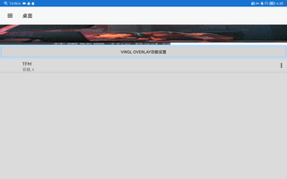

## 前言
- 使用第三方库实现gif背景播放 https://libraries.io/maven/pl.droidsonroids.gif:android-gif-drawable
- 使用工具： mt管理器 2.11.3
- 需要用到的文件： https://pan.baidu.com/s/1hHKe943jfTkYc4yPFxwO2w?pwd=c7ix 

## 引入
1. 用dex编辑器++打开dex，长按任意包名，导入smali.zip，选择导入到根目录。
2. 将libpl_droidsonroids_gif.so放入apk/lib/armeabi-v7a中。
## 添加布局
1. 将需要显示的gif图片放入apk/res/drawable中，重命名为gif_bg.gif。
2. 用arsc编辑器++打开resources.arsc
    - 打开drawable/drawable，在末尾复制上面一行的path，并将name改成`gif_bg`，里面的路径改为`res/drawable/gif_bg.gif`；
    - 打开drawable/type-info，复制一行上面的entry，并将id值+1，name改为`gif_bg`。
3. 在apk/res/layout中找到exagear主界面布局ed_main.xml，在其中找个合适的位置插入gif布局，我这里插入到了android.support.v7.widget.Toolbar的下面。\
将background设置为刚才在drawable/type-info中name填的字符串，高度宽度可以自己设置，下面那两个是设置居中。
    ```xml
    <pl.droidsonroids.gif.GifImageView
        android:background="@drawable/gif_bg"
        android:layout_width="match_parent"
        android:layout_height="72dp"
        android:layout_alignParentTop="true"
        android:layout_centerHorizontal="true" />
    ```
确保dex，arsc，xml都编译通过，签名apk后安装打开，如果不闪退的话，那么此时gif应该显示了。如下图。\
