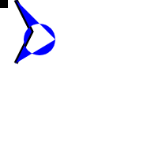
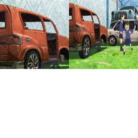
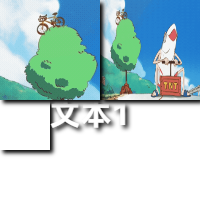
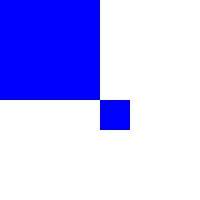

## 前言
canvas操作需要新建一个画布，然后在js中获取context进行绘制。
canvas的使用方法主要参考的教程是mdn上的
https://developer.mozilla.org/zh-CN/docs/Web/API/CanvasRenderingContext2D 。
前端框架用的vue3。

## 基础使用
在html中添加画布,js通过ref获取画布实例，获取context进行绘制。canvas必须要指定width和height属性。\
js通过ref获取实例，`ref<HTMLCanvasElement>()`是typescript的写法，规定传入的是HTMLCanvasElement，方便之后调用此接口的属性和方法。使用nextTick防止还有html元素没加载完。getContext('2d')获取context，用fillRect填充一个矩形，先提前指定填充样式为黑色。

:::: code-group
::: code-group-item html
```html
  <canvas
    style="width: 100%; border-style: solid; border-width: 1px"
    ref="canvasRef"
    :width="200"
    :height="200"
  >
    浏览器不支持canvas
  </canvas>
```
:::
::: code-group-item js
```js
import {ref,nextTick} from 'vue'
const canvasRef = ref<HTMLCanvasElement>()
nextTick(()=>{
    if(!canvasRef.value) return false;
    let ctx = canvasRef.value.getContext('2d')
    if(!ctx) return false;
    ctx.fillStyle='black'
    ctx.fillRect(50,50,100,100)
})
```
:::
::::
效果如下图\


## 填充与描边
### 填充
填充是跟fill相关的
- fillRect()就是填充绘制一个矩形。
- fillText()是填充绘制文字。可以设置对齐方式和基线。
    ```js
    const text = (ctx: CanvasRenderingContext2D) => {
    ctx.save();
    ctx.font = "bold 30px HarmonyOS Sans SC";
    ctx.textAlign='end'
    ctx.textBaseline='hanging'
    ctx.fillStyle = "#234554";
    ctx.fillText("文本1", 200, 0);
    ctx.restore()
    };
    ```
    效果如下图
    

- fill()是填充当前画布中全部路径构成的形状，如果路径未封闭那么先将其封闭。\
由于fill()会首先自动调用closePath()连接当前所有未闭合的路径，可能导致意外的结果，如下图，\

绘制一个圆形并填充为蓝色，但是由于之前绘制的黑色路径未封闭，所以折线与圆形连到了一起。解决方法是先调用一次beginPath()清空当前子路径列表。
- fillStyle，在填充前设置，填充的样式，可以是颜色，也可以是渐变等属性。下图为填充矩形为黑色的渐变透明。
    ```js
    const gradientRect = (ctx: CanvasRenderingContext2D) => {
    let gradient = ctx.createLinearGradient(100, 0, 150, 0);
    gradient.addColorStop(0, "black");
    gradient.addColorStop(1, "#00000000");
    ctx.fillStyle = gradient;
    ctx.fillRect(100, 0, 150, 200);
    };
    ```
    

### 描边
描边是和stroke相关的.

- strokeRect为画一个矩形的边框。
- strokeText为绘制文本的边框，但是为文字描边还是有点勉强，文字描边不如直接在底层偏移一下，多fill几次，这样能在保证文字原有粗细的情况下自由调节边框宽度，效果如下图。
    ```js
    nextTick(() => {
        //...
        ctx.font = "bold 30px HarmonyOS Sans SC";
        ctx.fillStyle = "black";
        drawTextBorder(ctx, "文本1", 100, 50, 3);
        ctx.fillText("文本1", 100, 50);
    });
    //绘制边框
    const drawTextBorder = (
        ctx: CanvasRenderingContext2D,
        str: string,
        x: number,
        y: number,
        size: number
        ) => {
        ctx.save();
        ctx.fillStyle = "aqua";

        //移动填充吧
        for (let offx = -size; offx <= size; offx++) {
            for (let offy = -size; offy <= size; offy++) {
            ctx.fillText(str, x + offx, y + offy);
            }
        }
        ctx.restore();
    };
    ```
    
- strokeStyle与fill的同理。
- stroke 如果使用路径绘制，只有在最后调用stroke() 路径才会被绘制出来

## 绘制图片
可以使用[imagedata](https://developer.mozilla.org/zh-CN/docs/Web/API/ImageData)，rgba数组的形式，也可以用html的[Image](https://developer.mozilla.org/zh-CN/docs/Web/API/HTMLImageElement/Image)引入现有图片。这里对Image的使用进行简单介绍。

Image就是html img标签的js形式，用法参考img标签就行，主要设置src图片地址，可能要考虑跨域等问题。
### 获取本地上传图片
- 上传图片用到了element-plus的el-upload组件。上传图片后，通过`URL.createObjectURL()`获取url。
    :::: code-group
    ::: code-group-item html
    ```html
    <el-upload :before-upload="handleMainImgUpload">
    <el-button>选择封面图</el-button>
    </el-upload>
    ```
    :::
    ::: code-group-item js
    ```js
    const mainImg = new Image();
    const handleMainImgUpload: UploadProps["beforeUpload"] = (file) => {
    mainImg.src = URL.createObjectURL(file);
    return false;
    };
    ```
    :::
    ::::
### 引用外部地址图片
- 我的需求是引用b站视频的封面。首先要调用api获取视频相关的信息，因为axois没法发送跨域请求，iframe也没法跨域获取其中内容，所以使用jsonp，安装第三方依赖vue-jsonp,在发送的请求后加上参数`{jsonp:jsonp'}`就行了。
- 获取到封面地址后，和本地图片一样，将地址赋值给subImg.src。这样浏览器会自动发送请求获取图片，
- 外部链接存在跨域问题，导致请求回复403。可以通过设置图片请求不携带referrer解决：`subImg.referrerPolicy = "no-referrer";`。
- 绘制到画布上，在画布将其内容导出为png图片时还会遇到跨域问题而无法导出，通过设置crossOrigin解决`subImg.crossOrigin = "Anonymous";`。
    ```js
    const subImg = new Image()
    nextTick(() => {
        subImg.referrerPolicy = "no-referrer";
        subImg.crossOrigin = "Anonymous"; 
        subImg.src = "";
    });
    const handleChange = (value: String) => {
        jsonp("xxxxx", {
            jsonp: "jsonp",
        }).then((res) => {
            subImg.src = res.data.cover;
        }).catch((e) => console.log(e));
    };
    ```
### 将图片绘制到画布上

绘制图片使用ctx.drawImage(image, sx, sy, sWidth, sHeight, dx, dy, dWidth, dHeight);\
设置图片的src后，图片加载完需要一定时间，所以需要等待图片加载完后再进行绘制。应在img.onload中调用drawImage()
- image-图像资源，即上面获取到的本地或外部图片
- sx，sy，sWidth，sHeight-用于裁切图片，分别是裁切起点和裁切宽高，sx和sy可以是负数，相当于图片左侧和上方有透明区域。
- dx，dy，dWidth，dHeight是在裁切下来的图片在画布上绘制的起点和宽高，dx，dy同样可以为负，dWidth，dHeight为负则会翻转图像。dWidth和dHeight如果不等于裁切宽高，则会在将图片画布上进行缩放。
- sWidth和sHeight是按图片未经dWidth，dHeight缩放时算的。如果我有一张超出画布尺寸的图片，想通过缩放修改其在画布上的尺寸并保证能填满画布，**那么裁切宽高应该/缩放倍率,缩放宽高应该等于缩放后的宽高**。比如图片原尺寸1920\*1080，我想裁切一块，并且将裁切的这块宽高\*0.5后绘制到画布上，要求绘制到画布上的宽高均为100，那么我需要设置sWidth,sHeight为200，dWidth，dHeight为100。如图所示。
    ```js
    const handleMainImgUpload = (file: File) => {
        mainImg.src = URL.createObjectURL(file);
        let ctx = canvasRef.value.getContext("2d");
        mainImg.onload = ()=>{
            ctx.drawImage(mainImg,100,0,100,100);
            ctx.drawImage(mainImg,0,0,200,200,0,0,100,100);
        }
        return false;
    };
    ```
    
### 将图片裁切至任意形状
我们经常需要对图片进行裁切，使用drawImage裁切图片只能裁切矩形而且计算起来很麻烦，所以使用`globalCompositeOperation`或`clip()`来进行自定义裁切。
参考教程：https://developer.mozilla.org/zh-CN/docs/Web/API/Canvas_API/Tutorial/Compositing
#### 使用图片叠加选项 globalCompositeOperation
设置canvas全局的组合选项为source-atop，让新图片仅绘制在当前画布存在图案的区域。
1. 用fillRect()填满画布，使用path绘制需要的形状（比如圆角矩形）并填充，设置叠加选项为用source-in，画布内容只留下path填充的形状，其余为透明。
2. 设置叠加选项为source-atop, 绘制图片，图片只会绘制在形状内部。如下图
    ```js
    drawRadiusRect(ctx, false);
    ctx.globalCompositeOperation = "source-atop";
    ctx.drawImage(mainImg,x,y);
    ctx.globalCompositeOperation = "source-over";


    const drawRadiusRect = (ctx: CanvasRenderingContext2D, stroke: boolean) => {
        const radius = 70;
        ctx.beginPath();
        ctx.moveTo(0, 0);
        ctx.lineTo(400, 0);
        ctx.quadraticCurveTo(400 + radius, 0,400 + radius,radius); //画曲线，第一个坐标是直角的坐标，第二个是目标位置
        ctx.lineTo(400 + radius, 800 - radius);
        ctx.quadraticCurveTo(400 + radius,800,400,800);
        ctx.lineTo(0, 800);
        ctx.lineTo(0, 0);
        ctx.globalCompositeOperation = "source-over";

        ctx.fillStyle = "white";
        ctx.fillRect(0, 0, m.fullWidth, m.fullHeight);
        ctx.globalCompositeOperation = "source-in";
        ctx.fillStyle = "black";
        ctx.fill();
        ctx.globalCompositeOperation = "source-over";
    };
    ```
    
#### 使用路径裁切 clip()
clip一次只能设置一个区域，如果要裁切多个区域，需要先save()保存当前画布状态，clip完再restore()恢复原始状态。
 - 可以参考上面的mdn教程。
### 按顺序绘制多张图片
 - 有时图片需要按顺序绘制，那么使用promise即可
## 绘制路径
具体教程可以参考文章开头的mdn教程
 1. beginPath() 清空当前子路径列表，并开始新的绘制
 2. moveTo() 准备在哪个坐标开始画
 3. lineTo() 画直线，从当前坐标到哪个坐标
 4. quadraticCurveTo() 画曲线
 5. closePath() 闭合当前全部路径
 6. fill()/stroke() 将绘制路径填充/描边，只有调用此方法后，画布上才会真正显示图形

## 阴影
canvas可以为绘制的图片或路径添加阴影，仅当shadowColor不为全透明时生效。可以设置的属性有shadowBlur，shadowColor，shadowOffsetX。shadowOffsetY。如下图\


## 保存和恢复当前状态
使用save()和restore()来保存当前的一些样式设置，样式已经设置会全局有效，所以在绘制一些图案时如果修改了样式，可能导致之后的绘制出错，此时可以在自定义绘制前调用save()保存原始状态，绘制后调用restore()恢复原始状态。如图，由于在其他函数里更改了fillStyle，导致想绘制的黑色矩形变为了蓝色。
```js
nextTick(() => {
    if (!canvasRef.value) return false;
    let ctx = canvasRef.value.getContext("2d");
    if (!ctx) return false;
    
    //想绘制一个黑色矩形
    ctx.fillStyle='black'
    //但是先做了一些其他操作
    someOption(ctx)
    ctx.fillRect(0,0,100,100)
});

const someOption=(ctx: CanvasRenderingContext2D)=>{
    // ctx.save()
    ctx.fillStyle = 'blue'
    ctx.fillRect(100,100,30,30)
    // ctx.restore()
}
```

<!-- <batchCover-example /> -->