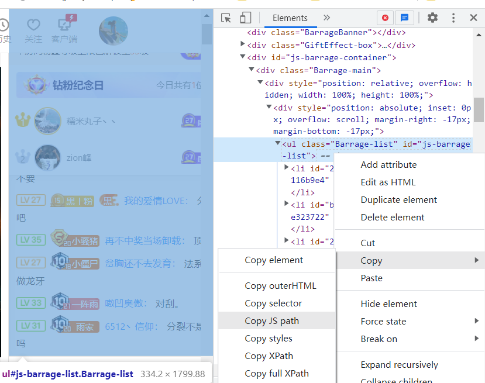

# 屏蔽斗鱼直播间的重复弹幕

## 目标
在人比较多的直播间，无法避免有人刷屏，一直刷同一条弹幕\
所以希望能够写一个脚本，将同样的弹幕只留下第一条，其他删掉不显示

## 分析
 - 环境：chrome浏览器+油猴插件，语言-JavaScript
 - 从dom元素入手，监听新增加的弹幕，如果检查是重复的话，就将其从dom树中删掉\
 弹幕分为两种：右侧弹幕栏和画面上方滚动的弹幕\
 
 - 初步检查过后发现右侧弹幕栏信息比较全，用户id，弹幕id啥的都有，但是画面上方滚动的弹幕则只有文字内容的信息。猜测应该是有一个数组用于存储用户弹幕的信息，然后数组改变时右侧弹幕和滚动弹幕一起改变，所以改这个原始数组也行。但是没有相关经验，先不考虑了。

## 实现
 1. `querySelector` 通过id和css筛选

     ::: tip
     querySelector函数传入一个css选择器，返回一个匹配到的DOM元素
     :::

     - 查找右侧弹幕所属的标签。右键对应元素，在开发者调试工具里找到弹幕对应的标签。右侧弹幕为一个ul。如图，鼠标放到对应标签上，会显示标签的覆盖区域。右键-copy-copy js path，会自动复制能够筛选出这个标签的queryselector：`document.querySelector("#js-barrage-list")`。#号就是id选择器\
    
     - 再找滚动弹幕所属的标签。右键滚动弹幕，发现弹出来的是斗鱼修改过后的弹幕功能栏，没法检查元素。那么换另一种方法，按f12进入调试工具，然后点击左上角的鼠标（如图），开启之后鼠标放到哪个位置，就会自动显示鼠标所指内容对应的标签。\
    通过这种方式，查找到弹幕所在一级的标签class为danmuItem-加上一串字符，向上看看它的父级，class为`danmu-加上一串字符`。
    
    因为不确定这串字符是否固定，所以不使用调试工具提供的JS path了。ctrl+f在elements里搜索一下，发现class包含`danmu-`的只有我们要的那一个，所以只匹配这部分就行。代码为`document.querySelector('[class*="danmu-"]')`。*号表示class包含danmu-字符串。更多匹配规则可以参考[CSS 选择器](https://www.runoob.com/cssref/css-selectors.html)
     - 到此，两个弹幕列表的dom都找到了，下一步就是想办法监听他们，在新增弹幕的时候可以对其删除。

 2. `DOMNodeInserted` 事件监听

     ::: tip [事件监听]
     使用`addEventListener`为DOM元素添加监听， 传入三个参数，第一个参数为`'DOMNodeInserted'`，表示当新的子节点插入到该DOM元素中的时候会触发监听；第二个参数为一个函数，表示触发监听时需要执行的操作；第三个参数为true，表示函数在新节点插入之前执行，如果false则表示函数在新节点插入之后执行。
     :::

    - 根据addEventListener函数的定义，我们主要填写的就是第二个参数-函数。\
    函数会接收到一个参数-事件对象e，`e.relatedNode`为被添加元素的父节点`e.relatedNode.lastElementChild`为即将被添加的新的子节点，那么前者.remove(后者)即可做到删除新增弹幕。
        ```JavaScript
        let list = document.querySelector('#js-barrage-list')
        //设置监听
        if (list != null) {
            list.addEventListener('DOMNodeInserted', (e)=>{
                //删除新增加的弹幕
                let p = e.relatedNode
                let c =  e.relatedNode.lastElementChild
                p.remove(c)
            }, true)
        }
                        
        ```
        此时运行脚本，可以看到滚动弹幕正常显示，右侧栏不显示弹幕了。说明监听生效。
    - 设置一个数组用于存储已出现的弹幕内容。每次新出现弹幕时，检查数组是否包含这个弹幕，如果没有，则将新弹幕加入到数组中；如果有，则将该弹幕对应的DOM节点删除。
        ```JavaScript
        //对比重复弹幕
        //list.lastElementChild.querySelector('.Barrage-content').innerText
        let subelement = element.querySelector('.Barrage-content')
        if (subelement) {
            let text = subelement.innerText
            if (savedanmu1.includes(text)) {
                //如果重复，则不显示
                e.relatedNode.removeChild(element)
                console.log('右侧弹幕列表发现重复弹幕，将其从父节点删除', text)
            } else {
                //如果不重复，则添加到数组中
                savedanmu1.push(text)
            }
        }
        ```

 3. 其他细节处理
 - 实际获取弹幕列表DOM时，需要使用setTimeOut等待几秒再获取右侧弹幕列表，而滚动弹幕列表貌似是在出现第一条新弹幕的时候才会生成，所以需要使用setInterval不断循环获取，直到获取到了再clearInterval停止循环。
 - 不知道存储弹幕内容的数组过长后会不会影响效率，可以考虑检查长度过长时清空数组。
 - 弹幕量有时比较大，判断时先通过声明变量将节点固定，再进行处理

## 效果
 如图，左侧为开启插件后，右侧为原始弹幕\


## 改进
 - 能否找到存储原始弹幕信息的数组，修改这个数组，那么两个弹幕列表也会自动随之改变
 - 添加对发送弹幕用户的判断，只有当重复弹幕是同一个人发的时候才会被删除，多个人发同一句话正常显示
 - 当鼠标放在一条正在滚动的弹幕上时，这条弹幕在dom树中会被移除，然后鼠标移走才会被添加回去，但是添加回去的时候又会触发一次判断，导致这条弹幕被删除。能否通过检查style中的起始位置什么的，来忽略这次判断。