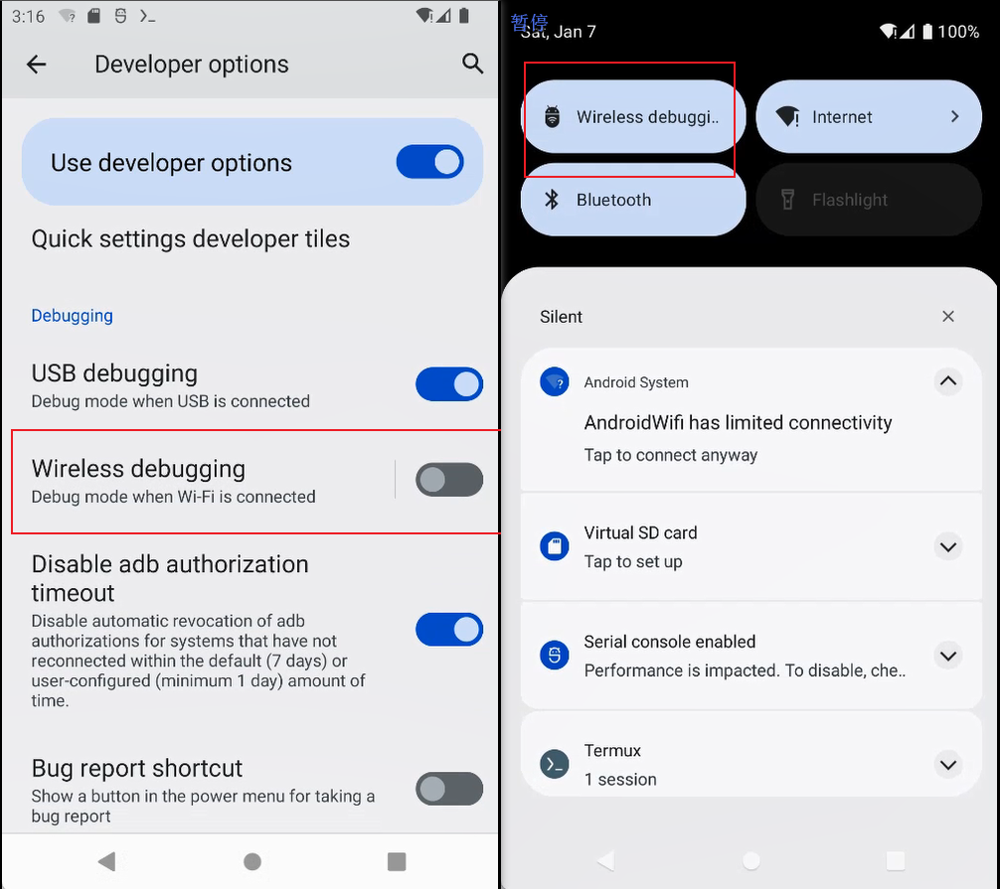

## 介绍
adb一直都有无线调试的功能。只不过在以前，需要先用usb连接adb成功一次，之后才能用无线。

安卓11及以上，开发者选项里有个无线调试，开启这个之后，第一次也不需要usb连接，直接用无线配对（需要同一网络）即可。

## 使用方法
[官方文档](https://developer.android.com/studio/command-line/adb#connect-to-a-device-over-wi-fi)
 
[部分参考](https://www.bilibili.com/read/cv15157405)

### termux安装adb
[termux下载地址(f-droid)](https://f-droid.org/en/packages/com.termux/)，有关termux基本使用（换源等）请自行搜索。

安装adb很简单，直接`pkg install android-tools`即可。

### 手机开启无线调试选项

首先开启手机的开发者选项（如何开启请自行搜索）。
然后进入开发者选项，勾选`无线调试`，如下图左。注意这个只有安卓11及以上才有。\
然后无线调试上面这个`快捷设置开发者图块(Quick settings developer tiles)`点进去，把无线调试也打开。这样在手机顶部状态栏下滑，第一个就是无线调试的选项了，如下图右。

### 手机与termux中的adb无线配对

1. 点击状态栏中的无线调试，进入后选择`使用配对码配对`（如下图左），点击后会弹出一个ip和配对码的弹窗（如下图中），这个需要在termux中输入，**但是一旦切出无线调试的窗口弹窗就会消失**，再点开又是另外一个配对码，所以必须用分屏/小窗（如下图右），保证弹窗一直显示着。

    

2. termux中输入：`adb pair 对话框中的ip地址和端口`，回车后输入对话框中的配对码，即可配对成功。
    

### 使用adb logcat查看输出日志
安卓应用如果允许调试（在`apk/AndroidManifest.xml`中，`application`标签加一条属性 `android:debuggable="true"`），就可以使用logcat查看其运行时的输出日志，闪退时也会输出报错。

使用方法：termux中adb连接成功后，输入`adb logcat`即可查看全部应用的输出日志。注意pkg安装的android-tools也带一个logcat（也就是输入`logcat`），但那个只能查看termux自己的日志。

如果想只查看某个应用的日志，可以使用grep筛选，如`adb logcat | grep 该应用进程号`。应用的进程号如何查找呢？先启动应用，然后输入`adb shell ps | grep 包名`即可获取。包名就是apk的包名，各种文件管理器一般都可以查看。
（图中这一条有很多信息，第二个是进程号，由于我用了grep，把每列的题头给筛没了。。。）

注意应用关闭后再启动，进程号会变化。

## 注意事项
1. 这种方法仅限安卓11及以上。
2. 无线配对需要在开发者选项里开启，然而我的鸿蒙3目前还没有这个选项。
3. termux里无需安装完整linux，直接`pkg install android-tools`即可使用adb功能。
4. 查看手机全部输出日志要用`adb logcat`而不是`logcat`。
5. 应用只有在AndroidManifest.xml的application标签声明了属性`android:debuggable="true"`时，才会在logcat中输出其日志。
6. 只显示特定app的日志：`adb shell ps | grep 包名` 获取进程号，然后`adb logcat | grep 进程号`
