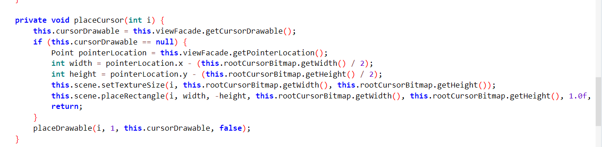

[[TOC]]
## 前言

部分游戏在进入游戏后光标无法显示，会退化成一个叉叉，非常难以辨认。感谢常心大佬的帮助，得知该设置在dex中，当无法获取鼠标图标时，就渲染一个10乘10像素的位图（叉）。因此修改这个位图为可辨认的鼠标图片就行了。测试了一下三国志11和红警3是可以的。

*经老虎山大佬告知，无法解决叉叉与真光标同时存在且偏移的情况（用辐射2测试了一下，这种情况的解决办法：保证游戏窗口占满画面，改环境设置的分辨率为游戏全屏时的分辨率；或者操作模式换成辐射的，通过右上的同步按钮对齐光标。）

修改前：\


修改后：\

## 演示视频：
[【Exagear】鼠标光标变为很小的叉 解决办法](https://www.bilibili.com/video/BV1oe4y1M7Go/?share_source=copy_web&vd_source=de2377a6a91c81456918f0dc49bfbd5d)
<iframe src="//player.bilibili.com/player.html?aid=648320384&bvid=BV1oe4y1M7Go&cid=910849854&page=1" scrolling="no" border="0" frameborder="no" framespacing="0" allowfullscreen="true"> </iframe>

## 将此功能添加到任意apk
如果你掌握apk的基础修改知识，可以通过本小节的教程将此功能添加到你自己的apk中。如果你是小白，那么应该去找已经修改好的apk直接使用。

1. 用MT管理器编辑dex，进入com.eltechs.axs.widgets.viewOfXServer包名下的AXSRendererGL类，替换整个createXCursorBitmap函数为以下内容。
    ::: details 点击展开代码
    ```smali
    .method private createXCursorBitmap()Landroid/graphics/Bitmap;
        .registers 8

        .prologue
        const/4 v6, -0x1

        const/16 v5, 0xa

        .line 14
        :try_start_3
        invoke-static {}, Lcom/eltechs/axs/Globals;->getAppContext()Landroid/content/Context;

        move-result-object v3

        invoke-virtual {v3}, Landroid/content/Context;->getResources()Landroid/content/res/Resources;

        move-result-object v3

        invoke-virtual {v3}, Landroid/content/res/Resources;->getAssets()Landroid/content/res/AssetManager;

        move-result-object v3

        const-string v4, "mouse.png"

        invoke-virtual {v3, v4}, Landroid/content/res/AssetManager;->open(Ljava/lang/String;)Ljava/io/InputStream;

        move-result-object v3

        invoke-static {v3}, Landroid/graphics/BitmapFactory;->decodeStream(Ljava/io/InputStream;)Landroid/graphics/Bitmap;
        :try_end_18
        .catch Ljava/io/IOException; {:try_start_3 .. :try_end_18} :catch_1a

        move-result-object v0

        .line 24
        :cond_19
        return-object v0

        .line 15
        :catch_1a
        move-exception v1

        .line 16
        .local v1, "e":Ljava/io/IOException;
        const-string v3, "TAG"

        const-string v4, "createXCursorBitmap: \u627e\u4e0d\u5230\u9f20\u6807\u56fe\u7247\uff0c\u8fd8\u662f\u7528\u00d7"

        invoke-static {v3, v4}, Landroid/util/Log;->d(Ljava/lang/String;Ljava/lang/String;)I

        .line 17
        invoke-virtual {v1}, Ljava/io/IOException;->printStackTrace()V

        .line 19
        sget-object v3, Landroid/graphics/Bitmap$Config;->ARGB_8888:Landroid/graphics/Bitmap$Config;

        invoke-static {v5, v5, v3}, Landroid/graphics/Bitmap;->createBitmap(IILandroid/graphics/Bitmap$Config;)Landroid/graphics/Bitmap;

        move-result-object v0

        .line 20
        .local v0, "createBitmap":Landroid/graphics/Bitmap;
        const/4 v2, 0x0

        .local v2, "i":I
        :goto_2c
        if-ge v2, v5, :cond_19

        .line 21
        invoke-virtual {v0, v2, v2, v6}, Landroid/graphics/Bitmap;->setPixel(III)V

        .line 22
        rsub-int/lit8 v3, v2, 0x9

        invoke-virtual {v0, v2, v3, v6}, Landroid/graphics/Bitmap;->setPixel(III)V

        .line 20
        add-int/lit8 v2, v2, 0x1

        goto :goto_2c
    .end method

    ```
    :::

2. 向apk/assets文件夹中添加一张光标图片，命名为mouse.png。这里提供一张。\


3. 编译dex，重装apk。再次启动游戏，自定义光标应该就会显示出来了。

4. [这是一个已经改好的apk ](https://wwqv.lanzout.com/iA2GC0hnjn2f)，改自[BV1d44y1U7K5](https://www.bilibili.com/video/BV1d44y1U7K5)，数据包也从这下载
## 探索过程
这次没什么过程，常心大佬直接告诉我了hhh

在AXSRendererGL类里，成员变量rootCursorBitmap就是那个叉叉的位图，用createXCursorBitmap()初始化。在placeCursor()里，首先尝试获取viewFacade的光标，如果获取不到，就用这个默认的叉叉光标。


直接在初始化函数里尝试从assets下读取mouse.png，读不到就还是新建个叉。读取成位图用BitmapFactory.decodeStream
## 总结
- 由于不是不显示而是显示的图片质量不高，所以换个对比度高的图片就好了。\
这个叉蛮反人类的啊。
