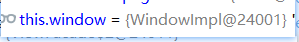

## 前言
exagear在使用gpu渲染之后，光标有无法正常获取而显示为“x”的bug。

曾经做过一次修复，在这里[exagear部分游戏中鼠标光标只显示一个小“×”图标的解决办法](../../../2022/winter/exagearDefaultCursor/)。不过过去的修复只能做到使用一张预先存好的鼠标图片，无法显示游戏自定义的光标样式。

在了解了一些X11 server的知识之后，再次尝试修复，让游戏自定义的光标正常显示。（目前测试结果发现动态样式无法正常显示）

~~这里应该放点演示gif但是太懒所以（~~

## 修改步骤
编辑apk的dex，找到`com.eltechs.axs.xserver.WindowAttributes`类，将其原`getCursor()`方法删掉（从`.method public getCursor()Lcom/eltechs/axs/xserver/Cursor;`开始删到`.end method`），然后把下面这个新的`getCursor()`方法粘贴进去。
```smali
.method public getCursor()Lcom/eltechs/axs/xserver/Cursor;
    .registers 2

    .line 102
    iget-object v0, p0, Lcom/eltechs/axs/xserver/WindowAttributes;->cursor:Lcom/eltechs/axs/xserver/Cursor;

    if-nez v0, :cond_1c

    .line 103
    iget-object v0, p0, Lcom/eltechs/axs/xserver/WindowAttributes;->window:Lcom/eltechs/axs/xserver/Window;

    invoke-interface {v0}, Lcom/eltechs/axs/xserver/Window;->getParent()Lcom/eltechs/axs/xserver/Window;

    move-result-object v0

    if-eqz v0, :cond_1b

    iget-object v0, p0, Lcom/eltechs/axs/xserver/WindowAttributes;->window:Lcom/eltechs/axs/xserver/Window;

    invoke-interface {v0}, Lcom/eltechs/axs/xserver/Window;->getParent()Lcom/eltechs/axs/xserver/Window;

    move-result-object v0

    invoke-interface {v0}, Lcom/eltechs/axs/xserver/Window;->getWindowAttributes()Lcom/eltechs/axs/xserver/WindowAttributes;

    move-result-object v0

    invoke-virtual {v0}, Lcom/eltechs/axs/xserver/WindowAttributes;->getCursor()Lcom/eltechs/axs/xserver/Cursor;

    move-result-object v0

    goto :goto_1c

    :cond_1b
    const/4 v0, 0x0

    :cond_1c
    :goto_1c
    return-object v0
.end method
```

## 原因
### 定位exa中光标获取代码
在上一次的探索过程中已经发现设置光标资源在AXSRendererGL的placeCursor函数中。`this.cursorDrawable = this.viewFacade.getCursorDrawable();`这是唯一一句对cursorDrawable进行赋值操作的。

进入getCursorDrawable函数，其逻辑为：通过光标位置确定其在哪个window里，然后通过`window.getWindowAttributes().getCursor()`获取光标。这一步如果获取的cursor为null的话那光标就会变×了。

确定光标位置所在窗口调用了`WindowHelpers.getLeafMappedSubWindowByCoords()`函数，看名字很清晰，全部窗口以树结构存储，这是根据鼠标坐标寻找其所对应的一个叶子节点窗口，且窗口可见。


### 分析代码逻辑，光标赋值与获取过程
接下来需要调试，查看光标被赋值到哪，获取又是从谁那获取。


- 光标获取是从WindowAttributes对象获取（每个window都有一个对应的attributes），而WindowAttributes中的光标赋值仅通过`WindowAttributes.update()`。\
打开茶壶，下断点发现：cursor被赋值的attr对应的window是24001。\

- 在获取到叶子节点之后下断点，观察叶子节点窗口，为23988，并非刚才赋值cursor的窗口。\
\
同时通过`xServer.getWindowsManager().getRootWindow()`获取整棵树，观察获取到的叶子节点在其中的位置，\
\
发现：在进入了几个子窗口之后，找到了（24001）刚才cursor被赋值的那个。而再看24001的子窗口列表，其唯一一个窗口就是23988，即用来获取cursor资源的窗口。观察宽高可知，24001是外部窗口，包含边框的宽高，而23988只是gpu渲染的部分，正好400 300。

现在的情况是，24001外部窗口有光标资源，23988内部窗口没有光标资源。获取光标资源时寻找叶子节点窗口，最终确定符合条件的窗口为内部窗口而导致无法正常获取到光标。

### 进行修改
顺带一提，经过测试，非gpu渲染情况下，不会出现23988这样的内部窗口，只有一个外部窗口，所以不会出现找不到光标的情况。

再顺带一提，根据[x11文档](https://tronche.com/gui/x/xlib/window/attributes/cursor.html)对window属性cursor的描述，当cursor为null时，就应该使用父窗口的cursor。而exa的代码中是没有考虑父窗口cursor这部分直接返回null的。

那么现在就有两种修改思路：
- 修正gpu渲染逻辑，让其不生成内部窗口。
- 修改cursor获取逻辑，在cursor为null时尝试获取父窗口的cursor并返回。

由于不懂gpu渲染相关知识，所以选择第二种方式修改。非常简单，奖WindowAttributes的cursor的getter方法修改为
```java
public Cursor getCursor() {
    //如果自己光标为null，但需要用光标了，则使用父窗口的光标
    if(cursor==null)
        return window.getParent()!=null?window.getParent().getWindowAttributes().getCursor():null;
    return this.cursor;
}
```

### 关于鼠标点击位置偏移问题
又尝试了一番，但目前仍然找不出鼠标位置偏移的解决办法。

目前发现可能存在的问题有：
- Window类实例有个属性是WindowAttributes类，其属性doNotPropagate是禁止向父窗口传递事件。Window的XClientWindowListener有个属性是eventMask用于限制该窗口允许处理的事件。修改光标位置可能会根据这两个mask来判断是否可以移动，若这两个mask值不正确则可能无法正常处理。详细信息可以看该[参考文档](https://www.x.org/releases/current/doc/xproto/x11protocol.html#requests:ChangeWindowAttributes)
- 缺少某些扩展协议的request函数的实现（如XTEST），如果固定光标位置通过扩展协议实现，则可能无法正常处理
- 窗口Focus相关的处理不完善。例如Event类型缺少FocusIn、Out事件的实现。如果固定光标位置通过取消游戏窗口焦点实现，则可能无法正常处理

## 总结
1. 参考资料：[有关window属性的介绍和对其修改的request](https://www.x.org/releases/current/doc/xproto/x11protocol.html#requests:ChangeWindowAttributes)
2. 光标显示为x原因：gpu渲染多出了一个子窗口导致的鼠标光标资源获取失败。本次修复后，光标显示情况理论上与非gpu渲染的情况相同了，原先能显示的修复后就能显示，原先显示不正常的（比如动态光标）修复后也会显示不正常。
3. 这种方式理论上是恢复了非gpu渲染时的获取cursor流程。实际测试发现，无法正常显示动态光标样式，会显示为黑色的静态图片，应该是exa的缺陷（毕竟原本就不支持gpu渲染）。