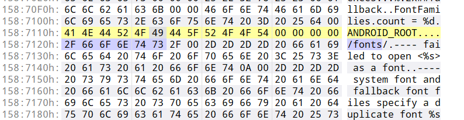

## 前言
PSTouch是远古的ps安卓版本，貌似在安卓5时期就不再更新了。现在网上能搜到一个适配了安卓9的版本，名字被改为了PSCC，版本号被改成了9.9.9，包名为`air.com.adobe.pstouchphone`。本次修改基于这个版本。貌似还有一个为平板打造的横屏版本，应该都差不多。

在安卓12上，pstouch会出现文字变为方框的问题。经搜索，发现早在安卓7时期就出现过类似的问题，解决方法是手动放字体文件：帖子[手把手教你安卓7.0完美运行PS Touch+修复乱码！！！](https://tieba.baidu.com/p/5033115738)。不过需要root，因为字体目录为`/system/fonts`。

考虑使用一种方法，在安卓12上不root也能让pstouch读取到字体。

修复前：


修复后：


## 探索过程
开启debug后启动pstouch并连接android studio，logcat中会输出一大串字体相关的日志，例如`system font and fallback font files specify a duplicate font /system/fonts/      , skipping the second occurrence`。其中相关路径也是`/system/fonts`。

由于`/system/fonts`这个目录需要root权限才能访问，所以需要将这个目录换掉。思路就是在apk的dex或so中搜索这个目录相关的字符串，找到后替换为外部存储路径（比如`/storage/emulated/0/Fonts`）即可。

### 定位相关代码
经搜索，dex中没有相关信息。而在搜索so时，虽然找到了`/system`或`/fonts`相关字符串，但改了之后并没有效果，logcat中字体报错部分的路径仍然是/system/fonts/。

既然不是直接获取，那就是间接获取了。这个路径可能是作为环境变量被设置好了，然后应用直接从环境变量中读取。

首先通过java代码`System.getenv()`，在安卓应用启动后获取全部的环境变量并打印日志。发现没有环境变量对应的是`/system/fonts`，但是有一个可以利用上的`ANDROID_ROOT=/system`。如果获取到这个环境变量的值，再拼接一段字符串`"/fonts"`就成了。

遂搜索字符串`ANDROID_ROOT`，发现在so中确实有这个



将其改成别的，再看logcat，发现字体日志部分，路径变为`/fonts/`了，说明`/system`这一部分路径确实是用环境变量获取的。需要修改的地方就是这里。


### 修改
有两种思路：
1. 修改路径前半部分。即修改环境变量的值，例如改为`/sdcard`，然后拼接成完整路径为`/sdcard/fonts/`。
2. 只保留路径后半部分。即给一个空的环境变量名，例如`NNN_ROOT`，然后将`/fonts/`改为`/sdcard/fonts/`。

由于是修改so，不方便改变现有字符串长度，第二种方法在有限的空间内可能装不下太长的字符串，所以选择第一种方法。

修改环境变量的方法可以参考[Java单元测试动态修改环境变量](https://blog.csdn.net/shirukai/article/details/115381505)，使用反射修改map或jni，我选择jni了，需要android studio生成一个apk，然后提取里面的32位so。

- dex修改：
    - 新增一个类。其中test.setEnv()是native方法。
        ```java
        public class test{
            public native static int setEnv(String key, String value);
            static {
                    System.loadLibrary("some-helper");
            }
            public static void setEnvsForRoot(){
                test.setEnv("BNDROID_ROOT","/sdcard");
                Log.d("测试环境变量", "BNDROID_ROOT="+System.getenv("BNDROID_ROOT"));

            }
        }

        ```
    - 在`air.com.adobe.pstouchphone.AppEntry.onCreate()`中，调用完super.onCreate()后设置环境变量。添加一行：
        ```smali
        invoke-static {}, Lcom/example/test;->setEnvsForRoot()V
        ```

- native函数：在some-helper.c中
    ```c
    #include <jni.h>
    #include <stdlib.h>

    JNIEXPORT int JNICALL
    Java_com_example_test_setEnv(JNIEnv *env, jclass clazz, jstring j_name, jstring j_value) {
        const char *name = NULL;
        const char *value = NULL;
        name = (*env)->GetStringUTFChars(env, j_name, NULL);
        value = (*env)->GetStringUTFChars(env, j_value, NULL);
        return setenv(name,value,1);
    }
    ```
- 编辑libCore.so: 搜索`ANDROID_ROOT`字符串改为`BNDROID_ROOT`。

----
改好之后，应用会读取BNDROID_ROOT环境变量，字体完整路径为`/sdcard/fonts`。也就是手机存储目录下的fonts文件夹，这个只要给应用存储权限就可以访问得到了。当然，还需要手动把字体文件放到这个目录中，也可以写点代码让应用启动后自动把ttf放到这个目录中，不过懒得写了。

成品：https://wwqv.lanzout.com/ihhOR0wowpmb

## 总结
1. 问题出现原因：无法读取到中文字体。不清楚为什么，理论上apk里应该是带了中文字体的。
2. 实际读取字体目录为`/system/fonts`，其中`/system`部分是从环境变量`ANDROID_ROOT`获取而来。
3. 安卓应用修改环境变量，可以在java中反射获取map修改，或在native函数正常修改。
4. 然而在我的鸿蒙3上测试，画布触摸没有反馈，也就是说没法编辑图片。在朋友的小米安卓12上测试是可以正常使用的。


