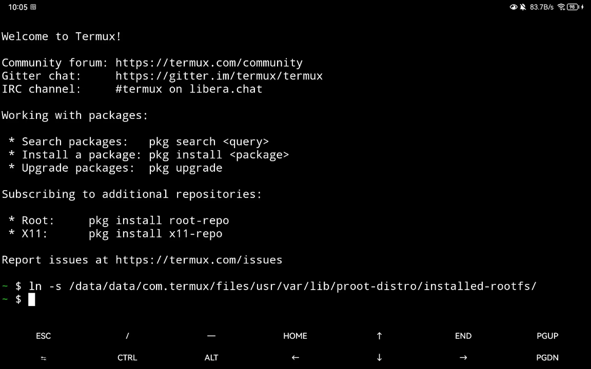

## 操作步骤
1. 打开termux，输入`ln -s /data/data/com.termux/files/usr/var/lib/proot-distro/installed-rootfs/`并回车。

2. 以MT管理器（v2.13.3及以上版本）为例，左上角菜单选择`添加本地存储`

3. 在打开的文件管理器中，点击左上角，选择`Termux`，然后点击`使用此文件夹`添加该存储路径。

4. 点击左侧本地路径中的Termux Home，即可查看termux内部文件夹，然后进入installed-rootfs文件夹中找到你安装的proot rootfs即可。

## 原理

在termux中，可以通过`termux-setup-storage`命令将安卓外部存储目录`/storage/emulated/0/`整个挂载到termux应用专属目录`/data/data/com.termux/files/home/storage`，以便在termux内部查看外部存储目录下的文件。

如果要在第三方文件管理器中查看termux内部文件，就需要用到安卓的文件提供器。部分文件管理器支持添加这类存储路径（比如MT管理器v2.13.3及以上版本）。

termux自带的文件提供器向外暴露的路径为`/data/data/com.termux/files/home/`，也就是说mt管理器可以看到这个文件夹。但是proot安装路径在`/data/data/com.termux/files/usr/var/lib/proot-distro/installed-rootfs/`，不在这个被暴露的文件夹内。所以需要通过软链接的方式，将`installed-rootfs`文件夹链接到`home`文件夹中。