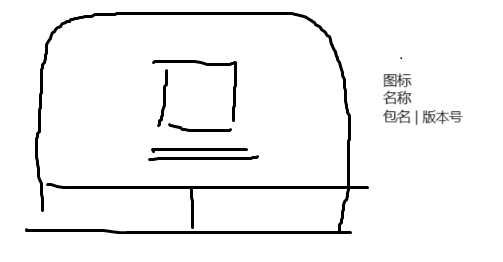
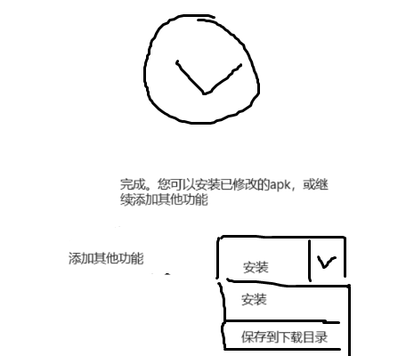

[[TOC]]

## 流程设计
1-> 2 -> 3

1：选择apk
2：选择功能。点击fab到3
3：修改，安装

每一步就是一个fragment。符合条件时，可以点击FAB进入下一个步骤。点左上角返回按钮或手机返回键返回到上一个步骤。

## fragment
### 整体结构
fragment结构如下，使用单activity，多fragment结构。三个步骤fragment都挂载到同一个fragment上，这样切换到help和settings时，不管当前在哪一步，都可以看做是从patch_main跳转过去的。
- activit_patch
	- fragment_patch_main
		- fragment_patch_step1
		- fragment_patch_step2
		- fragment_patch_step3
	- fragment_help
	- fragment_settings

### 重复进入（声明周期）
因为一次运行程序期间可以多次前进或后退步骤，所以需要考虑多次进入fragment时的数据处理。
- [fragment 声明周期](https://developer.android.google.cn/guide/fragments/lifecycle?hl=zh-cn#upward)，貌似切换fragment时，每次都会进入onStart，那么就在这里处理返回到上一步或者进入下一步之后的操作吧。
- 进入下一步之后，上一个fragment可能会被销毁，那么耗时操作和相关数据不能保存在fragment成员变量，需要找一个Global的静态实例存起来。
- 如果上一个fragment没被销毁，那么就要注意退到上一步之后，一些要求只能初始化一次的，不会被再次初始化
- 有没有跳转fragment，需要根据是否附带额外参数来进行不同操作的需求？

### navcontroller （fragment切换）+ 动画效果
想实现几个fragment互相切换。尝试了：
- FragmentTabHost，发现废弃了，而且 切换时fragment必定被销毁。
- tablayout+viewpager，support库貌似还没有viewpager2。另外思考过后，决定不允许用户通过tab任意跳转。
- 所以换到了NavHostFragment，貌似新建项目默认就是这个。

1. 布局xml中添加fragment，name设置为NavHostFragment。
	```xml
	<fragment
		android:id="@+id/patch_step_nav_host"
		android:name="androidx.navigation.fragment.NavHostFragment"
		app:defaultNavHost="true"
		app:navGraph="@navigation/nav_graph_patch_step" />
	```

2. 为其制定navGraph  `/res/navigation/nav_graph_patch_step.xml`，其中记录各个fragment以及跳转action。fragment的label为用户端标识，可能显示在toolbar上（如果代码中联动）。tools:layout可以在编辑器里指定这个fragment对应的视图预览。
	```xml
	<?xml version="1.0" encoding="utf-8"?>
	<navigation xmlns:android="http://schemas.android.com/apk/res/android"
		xmlns:app="http://schemas.android.com/apk/res-auto"
		xmlns:tools="http://schemas.android.com/tools"
		android:id="@+id/nav_graph_patch_step"
		app:startDestination="@id/fragmentPatchStep1">
		<fragment
			tools:layout="@layout/fragment_patch_step1"
			android:id="@+id/fragmentPatchStep1"
			android:name="com.ewt45.patchapp.fragment.FragmentPatchStep1"
			android:label="FragmentPatchStep1" >
			<action
				app:popExitAnim="@anim/nav_default_exit_anim"
				app:enterAnim="@anim/nav_default_enter_anim"
				app:exitAnim="@anim/nav_default_exit_anim"
				android:id="@+id/action_fragmentPatchStep1_to_fragmentPatchStep2"
				app:destination="@id/fragmentPatchStep2" />
		</fragment>
		<fragment
			tools:layout="@layout/fragment_patch_step2"
			android:id="@+id/fragmentPatchStep2"
			android:name="com.ewt45.patchapp.fragment.FragmentPatchStep2"
			android:label="FragmentPatchStep2" >
		</fragment>
	</navigation>
	```

3. 如果从1跳到2，则代码中调用
	```java
	Navigation.findNavController(requireActivity(),R.id.patch_step_nav_host)
		.navigate(R.id.action_fragmentPatchStep1_to_fragmentPatchStep2);
	```

viewId传布局xml中navHost（fragment）的，actionid传navGraph里设置的actionId

4. 为fragment切换时添加动画效果。在navGraph中，跳转对应的action标签，添加`app:xxxAnim`属性指定动画xml。
	```xml
	<!-- 动画 pop_back_in.xml -->
	<?xml version="1.0" encoding="utf-8"?>
	<set xmlns:android="http://schemas.android.com/apk/res/android">
		<translate android:duration="300" android:fromXDelta="-100%p" android:toXDelta="0"/>
	</set>
	```

	- 从1和2之间跳转的话，在对应action里设置 android:xxxAnim  例如`app:enterAnim="@anim/nav_default_enter_anim"`。我的想法是新的从右边出来，然后跳转到上一个时新的从右边退出去。
		- enterAnim: 控制1跳到2时，2的动画，x应该从100%p到0，即向左进入界面
		- exitAnim: 控制1跳到2时，1的动画，x应该从0到-100%p，即向左离开界面
		- popEnterAnim: 控制2返回1时，1的动画，向右进入界面。
		- popExitAnim: 控制2返回1时，2的动画，向右退出界面
	- 文档说明：弹出操作是指在导航时从返回堆栈上弹出其他目的地的操作。
	- 然后代码里，需要navController.navigate的时候传actionid.传fragmentid可以跳转但没有动画效果
	- 更多关于Navigation的说明：https://developer.android.google.cn/guide/navigation/navigation-ui?hl=zh-cn#listen_for_navigation_events
## 布局-约束布局

- 动态宽高：
	- 以自己视图内内容宽度优先，不考虑其他人的位置：width=wrap_content, 定值。
	- 忽略自身内容宽度，优先以其他视图的位置为标界：width=0dp, StartToxxx，EndToxxx，这样依赖的两个布局固定好之后，中间还剩多少宽度，自己就占多少宽度。
		- 过宽：使用width_max指定最大宽度。这个只有0dp时才管用。
	- 使用width=0dp+父布局wrap_content可能导致自己的宽真就是0，又或者textview文字较少时不希望拉的太宽，所以这个时候有必要用wrap_content。**但是wrap_content 在自己内容过长的时候，又会越界到别的视图上面，或者超出父布局，此时再加一个constained_width=true，就会在必要时限制宽度了。**
- 链式结构
	- 一组视图，比如1在2的上面，那么1指定BottomToTopOf=2，2又指定TopToBottomOf=1，那么1和2之间就绑定起来了，一直从头连到尾每个都制定TopToxx和BottomTo，此时就形成了一组视图链。
	- 可以指定这组链的分布结构chainStyle：packed 紧密居中，spread 分散居中，spread_inside 分散但上下顶满。
- width=0dp后不想居中：比如左右对齐父布局，如果自己内容不够宽，默认居中。如果想靠左，可以用layout_constraintVertical_bias=0 ，bias为0到1，默认居中就是0.5 


- 废弃的 `app:layout_constraintHeight_default="wrap"`
	如果子布局，比如高度0dp，然后上下都和父布局对齐，那么父布局（约束布局）高度设置成wrapcontent的话，子布局高度永远是0了，这时候就要设置
	app:layout_constraintHeight_default="wrap"，
	wrap是高度尽可能满足包裹住子布局。
	spread是子布局高度尽可能满足铺满父布局。

## 布局-CoordinatorLayout
CoordinatorLayout is intended for two primary use cases:
As a top-level application decor or chrome layout
As a container for a specific interaction with one or more child views

新建项目，默认根布局就是这个。
- 其直接子布局可以通过anchor和anchor_gravity来借助兄弟布局相对定位
- 其直接子布局可以指定behavior，处理触摸/滚动事件或与其他布局联动变化
	- 拦截触摸事件，并自己处理。
	- 处理滚动事件。
	- 判断自己依赖什么布局。当依赖布局变化，自己会接收到通知，可以根据依赖布局的变化而变化，比如底部插入snackbar时躲避。

### AppBarLayout
```
setSupportActionBar(binding.toolbar);

NavController navController = Navigation.findNavController(this, R.id.nav_host_fragment_content_pt_main);
appBarConfiguration = new AppBarConfiguration.Builder(navController.getGraph()).build();
NavigationUI.setupActionBarWithNavController(this, navController, appBarConfiguration);
```

这样可以将navHostFragment的那些fragment与actionbar联系起来
- 在navGraph.xml中，fragment的label属性会被当做标题显示在顶部靠左
- 若fragment跳转，左上角会显示返回按钮。

因为这是写在activity层的，我的一个fragment又有三个子fragment，这三个也用了navigation的xml，但是怕冲突就没绑定了。所以需要自己手动设置三个step的标题。跳转下一个fragment用fab，返回上一个用手机返回键。

然后设置stepTitle在切换到设置和帮助fragment的时候应该隐藏。直接acitivity里写一个公共方法 修改Visibility，然后fragment里requireActivity调用吧

acitivity里使用viewBinding的时候，会遇到xml中是 include的问题，如果想调用include指定的布局的子视图，要么再声明一个对应布局的Binding，然后bind(view)，要么给include指定一个id然后直接binding.includeId.xxx就行了。

### fab
因为一般都是见到fab在右下角，但是看md官网有在标题栏和内容中间的，所以这次尝试一下。

写法很简单，anchor定位到appbarlayout，anchor_gravity还是bottom|end，系统会自动把fab的圆心和appbar底端对齐，上下切一半。

step2的时候由于是checkbox也是在尾部，第一个功能的勾选框可能会被fab挡住。那就最顶端放点什么东西占一下位置，把第一个勾选框往下挤一挤。

帮助页面除了隐藏title还要隐藏fab。\
参考 https://developer.android.com/guide/fragments/appbar?hl=zh-cn#fragment 将toolbar整个移到fragment层，或者手动隐藏

现在切换到帮助fragment再切换回来，fab的图标会消失。。。而且只有step2 和3的会消失，1的不会\
解决办法：https://stackoverflow.com/questions/49587945 设置图标前需要先调用hide，设置后调用show。这是fab的一个bug（m2 28和m3 1都有）

### Behavior

#### xml insetEdge 躲避
为后插入的子布局，设置属性 `insetEdge="bottom"`，表明该视图是插入到底部。
如果有视图想要躲避这个插入视图，可以设置属性 `dodgeInsetEdges="bottom"`

fab也是用的这个， 怪不得fab的behavior里没看到有躲避snackbar的。
但是这个躲避只是整体位置上移，主体内容不能用这种方式，顶端会被appbar遮挡

#### 防snackbar遮挡
参考文档
- https://www.jianshu.com/p/7987293e8397
- https://blog.csdn.net/eyishion/article/details/121436522

主要是第二步，功能可能被遮挡

behavior要设置在协调布局的直接子布局上，xml中设置，layoutparams也有成员变量，但是一个子视图只能设置一个。

目前activity的xml结构：
- 协调布局
	- appBarLayout
	- include layout="content_main"

然后include的那个layout根布局是约束布局，而且已经设置了behavior`@string/appbar_scrolling_view_behavior` 
- 对应的值是`android.support.design.widget.AppBarLayout$ScrollingViewBehavior`，这个会自动空出顶部appbar的高度，不然上部内容就被appbar挡住了。
- 约束布局的子布局只有一个，就是fragment（navHost），这个只能用 match_parent，所以有所以有navController的就只能铺满全局了。。。
----
解决方案：
- appbar和snackbar都写到一个behavior里。自己写个类继承appbar的behavior，并且在dependency中指定除了appbarlayout，还有snackbar。然后接收到依赖视图更改时，根据类型再分别处理。
- 自己用textview实现一个snackbar，直接写在底端
- 因为behavior需要是协调布局的子布局，所以如果没法把布局往外放，就把协调布局往里收 。在fragment层再写一个协调布局。

就这么决定了，fragment_patch_main里再套一个coordinator，然后子布局还是只有一个就是三个step的navController，behavior设置成自己的。然后显示snackbar时，协调布局指定为fragment的

继承CoordinatorLayout.Behavior，
- layoutDependsOn里表明依赖布局是snackbarlayout。
- onDependentViewChanged里计算底端应该让出多少高度。snackbar弹出过程中这个函数会被调用很多次。注意要用getY()获取带tranlation等的坐标，才能实时获取其位置。然后就是计算高度并设置到margin上，因为是coordinator的子布局所以params类型应该不会错。
```java
public boolean layoutDependsOn(@NonNull CoordinatorLayout parent, @NonNull ConstraintLayout child, @NonNull View dependency) {
	return dependency instanceof Snackbar.SnackbarLayout;
}
public boolean onDependentViewChanged(@NonNull CoordinatorLayout parent, @NonNull ConstraintLayout child, @NonNull View dependency) {
	if (!(dependency instanceof Snackbar.SnackbarLayout) || dependency.getY() <= child.getY())
		return super.onDependentViewChanged(parent, child, dependency);

	CoordinatorLayout.LayoutParams params = (CoordinatorLayout.LayoutParams) child.getLayoutParams();
	params.bottomMargin = (int) (parent.getHeight() - dependency.getY());
	if (params.bottomMargin < 0) params.bottomMargin = 0;
	child.setLayoutParams(params);
	return true;
}
```
然后xml中给自身高度需要改变的视图加上`app:layout_behavior=".widget.AdaptSnackBehavior"`

#### 下滑查看日志
- 参考文档
	- https://www.jianshu.com/p/5e6f2ae1d2ec
	- https://blog.csdn.net/eyishion/article/details/121436522

知道为什么coordinator的子布局constraintlayout要设置scroll behavior了，因为可以实现滚动时隐藏actionbar。https://www.jianshu.com/p/5e6f2ae1d2ec

- 界面设计
	- 日志放在appbar里，然后下拉可以查看
	- 下拉超过一定高度，展开后全屏，fab图标变为叉，点击折叠
	- 在执行action的时候自动展开日志界面？
		

- 大概实现思路：
	- 使用CollapsingToolbarLayout，然后下拉时展开appbar显示出日志，应该需要重写nestedScroll相关。
	- 拉动appbar与主体内容间的小横条，就能往下拽（像地图的那种，但是找不到地图怎么写的了，也许是bottomDialog）
	- 或者滑动主体内容，也就是在刚写的那个behavior里再写一个下滑操作。。可以参考下拉刷新的SwipeDismissBehavior？
	- 直接放右上角menu，点击跳转fragment，简单省事。
	- 要执行action时放到global里，然后跳转日志fragment，然后fragment初始化并执行action，同时刷新显示日志（同时更新历史记录）。如果跳转fragment后发现没有action，就从历史记录中获取日志并且不会刷新

- 具体实现思路：
	- 如果是拖拽一个视图（写ontouch拖拽），然后另一个视图（日志视图）依赖这个视图位置而显示呢？设计：拖拽视图在appbar底部往上一点。然后拖拽时上下移动，appbar接收到变化，也跟着设置日志的高度，这样仿佛appbar是被拖拽视图给拽下去了。
	- 布局设计，由于三个没有形成链式结构，默认会坍缩成dragbar和title紧密相连。当dragbar向下移动时修改marginTop，这样空出的margin正好用来显示日志视图。
		

- 最终选择
	- 使用普通AppbarLayout（也许以后可以考虑CollapsingToolbarLayout。），写一个AppbarSwipeBehavior，重写Touch相关。
	- 可以参考HeaderBehavior（AppbarLayout.Behavior的父类的父类）
	- 注意patch_step_title的根布局 要设置成clickable和focusable，不然触碰事件会被终结。
	- 可能是在xml中指定了appbar的原因，文字变成白色了。不好用cardview，就直接appbar的主题色蓝色作为背景了。

- ConstraintSet
	一开始想着是只用一个布局，后来发现需要在代码里改dragbar的params，然后发现params建议用ConstraintSet，然后发现ConstraintSet切换子视图属性可以通过克隆另一个约束布局的xml，于是就可以分开写了，一个折叠的，一个全屏的xml。
	- 代码用法：克隆新布局，applyTo 约束布局
		```java
		set = new ConstraintSet();
		set.clone(context, R.layout.fullcreen_layout);
		set.applyTo(mConstraintLayout);
		```
	- 注意需要每个子布局都有id
	- 只能切换约束布局的直接子布局的属性，孙子布局，父布局（约束布局）属性都无法改变。并且textview的textAppearance这种不行。
	- 切换前后，只会对比相同id的，切换之前后之后，id不存在的，会留在那不动。
	- 在代码中，添加TransitionManager 在setapplyTo之前，可以使布局变化带上默认动画。

----
突然发现onInterceptTouchEvent 会接收全部兄弟视图的触摸事件。。所以onTouchEvent里必须要用一个flag判断，只有在intercept中设置flag为true了之后onTouchEvent才能继续往下操作
	
fab没法写，因为没法还原当前step的图案和listener。所以只能隐藏了，再加一个按钮。

定义四种状态：已折叠，展开中，已展开，折叠中。只有在合适的状态才做对应的操作。

- 拦截触摸事件条件：
	- 下拉时，要求手指起始位置在appbarlayout内（判断触摸位置是否在视图内，可以用CoordinatorLayout.isPointInChildBounds()），且方向为向下
	- 上滑时，手指起始位置在dragbar内，且方向为向上

- 拦截后，处理触摸事件过程中：
	- 下拉时，修改dragbar的marginTop，应保证yDiff>=0时才修改。(等于0是松手重置时需要)
	- ~~上滑时，修改dragbar的marginBottom。应保证yDiff<=0时才修改。~~。由于全面屏手势，底部上滑与切后台冲突，所以只好改用按钮点击退出全屏了。

- 处理触摸事件，松手后
 	- 更改currState（退回或前进）
	- 如果不够距离，回弹，dragbar的margin归零
	- 如果移动距离超出最小距离，则使用ConstraintSet切换，同时修改appbarlayout和约束布局的高度为match_parent或wrap_content。
	- 隐藏或显示fab和toolbar。不知道为啥hide()没用，只能setVisibility(Invisible)
	- 全屏时屏蔽返回键。记录在global中，然后acitivity重写onBackPressed


## patchMain

每个step，在OnStart的时候：
- 切换fab显隐以及图标。
- 设置当前步骤对应标题 StepTitle	
- 初始化数据

fab图标：step1和2是向右箭头，点击执行action并进入下一步，step3是对号，点击安装新apk。

## 1 选择apk
1. 界面
	

2. 运行逻辑
	- 已存在apk -> 显示fab，显示apk信息
	- 不存在apk -> 隐藏fab，更新apk信息

3. 关键代码

	- 读取本地apk文件信息：`packageManager.getPackageArchiveInfo()`
	**突然发现返回的packageInfo里可以检查service信息。可以用这个来判断virgl overlay是否存在了**

	- `void updateApkInfo(Uri uri) ` 
		- 若传null，则读取已复制到对应目录的本地apk信息，不解包。
		- 不为null则认为uri为用户新选择的apk，对apk解包后，在调用一遍自身，传null。
		- 为null 且 apk信息读取成功，则显示fab按钮，允许用户进入下一步。
## 2 选择功能
1. 界面
	- 主要就是recyclerview，显示全部功能。
	- 根据md官网样例，每个item，顶头是图标，然后是文字，勾选框在最后。
	- fab在主体内容右上角，可能会挡住第一个item的勾选框，所以最好在最上方先放点内容，把回收视图往下挤挤。由于用户可能没有意识到下面还有内容可以往下滑，所以正好可以在这里写上可添加功能个数，用户一数就发现不对了。
	- 点击item，显示详细简介。点击图标显示大图。可以用底部dialog。item主文字为功能名，副文字为当前版本和最新版本。
	- 宽屏适配，过宽时显示两列。
	- 如何暗示用户回收视图还可以往下滑？
		1. 顶部统计数据显示总共有多少个功能，用户一数就知道个数对不上。
		2. 为回收视图添加一个背景（比如CardView），在没到底时，背景底部会被直直地切割，用户一看就知道不对劲。
		3. 回收视图永久显示滚动条，用户就知道还能滑动到哪了。

2. 运行逻辑
	- 进入step2后，解析当前已解包的exagear apk，分析其已添加的功能及其版本。
	- 已经是最新版本的功能，直接设置disable，功能名也变浅色？
	- 只有点击末尾checkbox才能勾选，点icon或功能名是显示介绍。
	- 统计数据显示共有多少功能，以及本次勾选几个功能（可勾选总数应该去掉已是最新版本的）。初次进入，和每次勾选变化时，都更新统计数据。
	- 闲着没事，统计数据用cardview，加个波纹背景，点击可以折叠或展开（虽然总共就两行。原本想着三行但是太占地方了）
	- 点击fab之后，执行action。只有action全部执行成功时，才进入step3。否则留在当前界面，并弹出snackbar提示用户查看日志。

3. 关键代码
	- 功能名的textAppearance用了Switch的 `@style/TextAppearance.AppCompat.Widget.Switch`。这样平常是纯黑，设置disable可以变灰。但是发现设置disable之后无法点击了，那没法查看帮助了，还是放弃disable。

	- 功能列表model：
		- 新建模型类 FunctionInfo，用于存储每个功能的信息：图标resid，功能名，简介，简介图片id，添加功能时对应的Func（action）。
		- 除此之外，还有三个int值 `instVer,latestVer, newlyChecked`，用于step2中统计信息，当前版本，最新版本和本次是否添加该功能。
		- functioninfo添加一个静态实例，记录当前edpatch可添加的全部功能。
		- 由于fab功能包含多个版本号，需要显示未用户友好的数字，所以为Func再添加两个默认接口`getInstalledVersionFormatted，getLatestVersionFormatted`也是返回int。instVer,latestVer存这俩的值。
		
	- onStart和勾选变化的时候，刷新统计数据。

	- 点击fab，执行action。根据newlyChecked获取本次要添加的功能。 注意newlyChecked也可能过时，所以 ==1 之外还要判断当前版本不等于最新版本， 才算作用户选择了一个

	- cardView 点击波纹效果见主题样式（m2,m3）那一节。

	- 回收视图宽屏时改为两列：
		xml中，指定layoutManager为grid：`app:layoutManager="android.support.v7.widget.GridLayoutManager"`，通过spanCount控制列数`app:spanCount="@integer/patch_step_func_item_column"`
		可以使用xml限定符来实现。新建一个integers.xml，对应值填1，新建integers-w820dp.xml，对应值填2。当宽度足够时，优先从w820dp的xml中获取数值，即可自动获取到2.

### itemdecoration 分割线
参考 
- https://www.jianshu.com/p/13ad63ba5e08
- DividerItemDecoration的源码


实现分割线的方式：
1. 在item视图中顶部或底部加一条分割线。缺点：没法控制第一个或最后一个的分割线不显示。
2. 使用回收视图的ItemDecoration，sdk提供了一个原始的分割线 DividerItemDecoration。缺点：一列还行，两列的时候，中间不分割，瞅着很别扭。
3. 自己实现ItemDecoration。把中间分隔开，甚至还可以画一条竖线。

自己实现item装饰物 DividerGridItemDecoration 继承 RecyclerView.ItemDecoration，重写 getItemOffsets和onDraw。
- getItemOffsets
	- 参数：Rect rect, View view,  RecyclerView parent, RecyclerView. state。看来是每个item都会调用一次。这个函数会为每个item的视图定义上下左右要空出的距离，写到rect里。空出距离后，待会就可以在空白处画装饰物了。
	- javadoc说，call getChildAdapterPosition(View) to get the adapter position of the View.  不过我这里没用到，因为给的参数state.getItemCount()直接返回的就是全部数量，而不是显示数量了。（顺便一提，貌似一般viewPosition指的当前屏幕上可见的那几个item的顺序第一个可见的序号就是0。adapterPosition指的是对应在数据列表中的位置。）
	- 如果不是最后一行，就在item下方留出2dp的分割线高度。判断依据：总数减去最后一行个数，当前item序号只要超过这个就是最后一行。`itemPosition >= itemCount - Math.max(itemCount % spanCount,spanCount`) 则为最后一行。
	- 如果不是最后一列，就在item右侧留出2dp分割线宽度。判断依据：item序号+1能被spanCount整除则为最后一列。`(itemPosition + 1) % spanCount == 0`

- onDraw
	- 参数：Canvas c, RecyclerView parent, State state。 根据divider源码，这里用了for循环遍历全部itemView，所以这个函数调用一次，会画满整个屏幕。
	- 谷歌提供的分割线装饰，就是直接从parent（回收视图）的左一直画到parent的右。所以我们需要改成从itemview左画到itemview右。
	- 一些函数：
		- parent.getChildAdapterPosition(child);//绝对位置
		- mDivider.getIntrinsicHeight(); 获取drawable的高度，我没用这个，直接固定2dp了
		- parent.getDecoratedBoundsWithMargins(child, this.mBounds); 
	- 源码中，画之前用了canvas.save()，画之后canvas.restore()；不明白为什么，看save()介绍说是保存当前画布内容，之后restore()的时候再恢复之前保存的内容。但是调用这个装饰物也正常绘制了啊，而且不写也正常。（啊，懂了，原来保存恢复的是平移，缩放这样的画布状态，至于画布上的图案，并不会覆盖）
	- for循环中，循环的个数应该以view个数为准，没显示在屏幕上的数据可能没有对应的view。然后如果要获取当前view对应的数据的adapter序号，用parent.getChildAdapterPosition(view)
	- 从哪画到哪，上下左右边界
		```
		parent.getDecoratedBoundsWithMargins(child, this.mBounds); //这个是包括刚才getItemOffsets加进去的空余区域
		int bottom = this.mBounds.bottom + Math.round(child.getTranslationY());
		int top = bottom - weight;
		int dividerLeft = mBounds.left+dividerMargin,dividerRight = mBounds.right-dividerMargin;
		//默认divider这里是从recycler左一直滑到recycler右，所以两列的话中间不断开。改成item做左到item右就行了
		this.mDivider.setBounds(dividerLeft, top, dividerRight, bottom);
		this.mDivider.draw(canvas);
		```


## 3 修改完成界面
1. 界面
	
	- 一个大大的对号
	- 下方为两个按钮，返回和安装。根据md设计，返回按钮可以给它整成无边框样式的，然后着重突出安装按钮。
	- 根据play商店的灵感（安装旁边还有个下拉菜单可以选择更多设备），给安装按钮旁边放一个spinner，点击后展开多个按钮（导出到下载目录）

2. 运行逻辑
	- 只要进入这个界面，就说明新apk已经存在了。此时唯一要进行的操作就是安装新apk。
	- 之前如果要在本地文件查看，需要自己去外部data里找，这次不如直接导出到Download。
	- 设计界面的时候，还没有确定fragment跳转方式，现在既然可以返回键跳转到上一步，那么点添加其他功能就没有意义了，因为这样和返回键功能重复了，所以改成返回首页，即一次跳两下，返回step1.
	- fab可有可无，如果存在，就是显示一个对号，表示不能再往下走了，点击的话，执行操作就相当于点了安装按钮，这个功能重复也没办法了。


3. 关键代码
	- 跳转上一个fragment，在用navHost的情况下，可以获取navHost（xml中fragment标签的那个） 然后 `NavController.navigateUp();` 

	- 下拉样式：style="?android:spinnerStyle"。
		- 但是不知道spinner的样式靠不靠谱啊（之前这个三角显示老出bug），要不自己写一个drawable。发现设置到background后三角太大，怎么缩小background，还不改变宽高？（宽高改了点击范围就太小了）貌似没办法，只能改xml中的坐标位置了

	- 导出到下载目录貌似比较麻烦。（mediastore scanFIle插入？https://developer.android.google.cn/training/sharing/send?hl=zh-cn#send-binary-content）还是分享试试吧
		- fileprovider https://developer.android.google.cn/reference/android/support/v4/content/FileProvider
		- shareSheet https://developer.android.google.cn/training/sharing/send?hl=zh-cn#why-to-use-system-sharesheet
			```java
			Intent shareIntent = new Intent(Intent.ACTION_SEND)
					.putExtra(EXTRA_STREAM, getUriForFile(requireContext(), getResources().getString(R.string.provider_ato), getExaNewPatchedSignedApk()))
					.setType("application/vnd.android.package-archive");
			startActivity(Intent.createChooser(shareIntent, "可以使用以下应用查看"));
			```
		- 还是有点问题，这个貌似不会被认为是打开该文件而是分享该文件，没有正常查看这种选项，都是压缩，复制这种


## xml drawable
path的字母含义：M 移动到坐标处，L 新坐标与上一个点连线。 Z 与第一个点连线，闭合。这个坐标，是以viewportWidth和Height为基准的。但是最终显示的宽高，是width和height定义的
一些绘图工具 https://juejin.cn/post/6844903494906806285

dragbar的话，用shape矩形+圆角就行了。点坐标的话会拉伸


## 耗时操作 
### actionpool
原先是一个actionsubmit一次。现在新增一个函数submitGroup，一次传入多个action，以及一个callback（不用在构造函数时传入的callback了），新建一个线程，执行全部action，最后调用callback.done()显示dialog确定按钮等。

每次执行action前，创建一个dialog，在当前任务组未结束之前，dialog不会关闭，无法点击界面执行其他任务，因此不会出现同一时间有两个线程都在执行action的情况。

### progressDialog
在执行action时，需要耗费大量时间，本来是想着再appbar底部加一个进度条，但是太麻烦了，还是图省事直接用dialog挡住。

处理action正在执行，完成，失败的显示文字，放在dialog中，这样调用 actionPool的代码放在dialog中，fragment只需要新建一个dialog，然后写一个完成时的操作回调即可（参数为是否有错误）。

执行过程中
- 在每行前添加图标，表示状态。⏳ ✔️ ❌ 找了三个emoji。
- 还要将文本写到Global的数据中，以便之后显示日志视图时获取历史记录文字。

执行结束后
- 显示确定按钮。若无错误，直接performClick
- 修改旋转进度条的drawable，错误时改为错误图标。
-  为节省文字，出错的时候不显示具体内容，只提示用户查看日志。
	
完成时修改drawable后，不显示，需要手动设置bound
https://stackoverflow.com/questions/23124366/android-progressbar-setindeterminatedrawable
```java
ProgressBar progress = findViewById(android.R.id.progress);
Rect bounds = progress.getIndeterminateDrawable().getBounds();
setIndeterminateDrawable(getContext().getDrawable(noError ? R.drawable.ic_check_circle : R.drawable.ic_error));
progress.getIndeterminateDrawable().setBounds(bounds);
```

getButton和setButton：
- 开始时先getButton将确定按钮禁用。全部执行完之后再启用。结果是执行完了也没启用。后来发现是完事的太快，以至于启用在禁用前被执行了。
- 构造函数里直接getButton还是null 用onShowListener的话又太慢，所以放到onCreate里了。setButton放构造函数里没问题

## 主题样式，颜色
目前主题继承的是Theme.AppCompat.Light.DarkActionBar，只能设置三种颜色，而且默认按钮颜色不跟这个走

不过可以继承 material的，设置更多颜色
https://blog.csdn.net/qq_43478882/article/details/123132004
https://blog.csdn.net/googledevs/article/details/109567406

主题和样式均在styles.xm中。
扩展主题：
- parent：`<style name="GreenText" parent="TextAppearance.AppCompat">` 继承parent中的全部样式
- 点继承：`<style name="GreenText.Large">` 继承GreeText中的全部样式。
- 若两者同时存在，则父样式会替换通过点表示法继承的任何样式。

----
m3主题

m2时， 基本主题`Theme.ExagearSupportV7包` parent是 `Theme.AppCompat.Light.DarkActionBar` 。按钮背景始终为灰色，需要手动指定 
```
<item name="android:buttonStyle">@style/Widget.AppCompat.Button.Colored</item>-->
```
现在m3改成 `Theme.MaterialComponents.Light.DarkActionBar`。结果发现与正经m3（jetpack）还是不一样。这个support.design的materialcomponent主题貌似也没有m3的那些颜色设置。。。还是三个color

Material按钮：
- 文字间距变大了
- 按钮背景样式不需要手动指定而且没有默认边距了。
- xml中声明button自动变为MaterialButton，结果background属性无效了。。。如果在theme后面加上.Bridge，就又退化到m2那时的灰色背景，所以需要改背景图的换成用ImageView了。
- 设置无边框的话，`style="?borderlessButtonStyle"` 问号后不能加android: 否则也无效。
- dialog的确定按钮也变成带背景色的了。。。。拉勾霸道用.Bridge了

从m2迁移到m3时，注意activity_pt_main.xml布局里有直接引用appcompat的style（这个貌似改不改都行，我看androidx的新建项目，这里用的还是appcompat）。以及部分地方的textappearance

cardview点击波纹效果：
- 需要v7的Cardview，或design的CircularRevealCardView，design的普通CardView不行。添加属性 `android:foreground="?android:attr/selectableItemBackground"`. 
- 主题是mdc或appcompat都行。

snackbar的背景为黑色，按钮还是深色的话看不清了就
```xml
<!-- 主题中修改snackbar按钮样式 -->
<item name="snackbarButtonStyle">@style/SnackbarButtonLight</item>

<!-- 按钮指定为无边框，颜色为浅色。貌似直接指定accent没用 -->
<style name="SnackbarButtonLight" parent="Widget.MaterialComponents.Button.OutlinedButton">
	<item name="buttonStyle">?borderlessButtonStyle</item>
	<item name="android:textColor">#9ea8d9</item>
</style>
```


## 布局变化 默认动画
android:animateLayoutChanges="true"
放在根布局（？）上。布局变化时会添加默认动画效果。
貌似有时候不好使，只能布局个数变化时触发？

TransitionManager.beginDelayedTransition(parent);对下一帧的布局变化添加默认动画。setlayoutparams等之前调用一下就行了。
