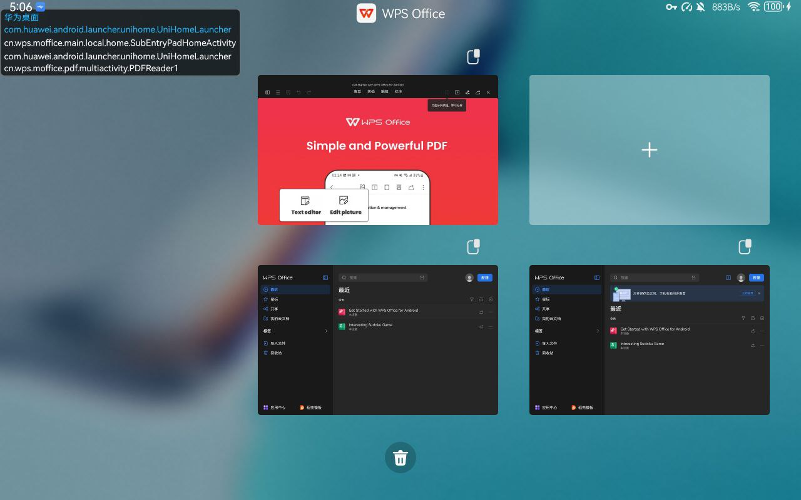

[[TOC]]

## 最近任务栏特性
打开两个窗口（比如进入wps，再打开一个文档）时，华为（以我平板的鸿蒙4.0为例）最近任务栏里，右上角会显示数字，点开之后可以查看已启动的全部wps相关进程，并且可以再创建一个wps主界面




去play商店下了wps office，包名和华为应用商店的相同，但是没有这个功能，
华为商店下的传到小米miui10上也没有这个功能


## 看看activity跳转：

普通应用：

切换到最近任务栏：
- com.huawei.android.launcher.unihome.UniHomeLauncher

切换回应用：
- 先是 com.tencent.mobileqq.mini.appbrand.ui.AppBrandUI
- 然后 com.huawei.android.launcher.unihome.UniHomeLauncher

wps office
- 启动第一个主界面，是cn.wps.moffice.main.local.home.PadHomeActivity
- 打开一个pdf，是cn.wps.moffice.pdf.multiactivity.PDFReader1
- 从最近任务新建一个主界面，是cn.wps.office.main.local.home.SubEntryPadHomeActivity

## 看看 manifest
搜索关键字huawei
看到一些权限
```
<meta-data android:name="com.huawei.android.quickaction.quick_action_service" android:value="cn.wps.moffice.main.HWQuickActionService"/>
<meta-data android:name="com.huawei.android.multiwindow.multiinstance.targetactivity" android:value="cn.wps.moffice.main.local.SubEntryActivity"/>
<meta-data android:name="com.hihonor.android.multiwindow.multiinstance.targetactivity" android:value="cn.wps.moffice.main.local.SubEntryActivity"/>
<meta-data android:name="com.samsung.android.multiwindow.activity.alias.targetactivity" android:value="cn.wps.moffice.main.local.SubEntryActivity"/>
<meta-data android:name="com.vivo.android.multiwindow.multiinstance.targetactivity" android:value="cn.wps.moffice.main.local.SubEntryActivity"/>

<meta-data android:name="com.huawei.android.multiwindow.multiinstance.enable" android:value="true"/>
<meta-data android:name="com.huawei.android.multiwindow.multiinstance.level" android:value="1"/>
<meta-data android:name="com.hihonor.android.multiwindow.multiinstance.enable" android:value="true"/>
<meta-data android:name="com.hihonor.android.multiwindow.multiinstance.level" android:value="1"/>
```

看来是适配了华为，荣耀，三星，vivo？
它这个`cn.wps.moffice.main.local.SubEntryActivity`已经和刚才新建的`SubEntryPadHomeActivity`很接近了，点开一看，就是根据屏幕尺寸选择启动手机或者平板activity
```
if (DisplayUtil.P0(this)) {
	intent = new Intent(this, SubEntryPadHomeActivity.class);
} else {
	intent.setClass(this, SubEntryHomeRootActivity.class);
}

```

不过这个好像只是支持基本的支持多实例？

----
## 单应用多窗
在华为开发者文档中看到了一个提到这个的东西
https://developer.huawei.com/consumer/cn/doc/other/split_screen-0000001295870461#section1985mcpsimp

`目前仅部分支持多实例的应用可以单应用分屏，通过侧边栏触发分屏时，使用应用的图标颜色来帮助判断，该应用是否支持单应用分屏`
也就是说如果app启动着的时候，拉出小窗侧栏，侧栏里的该图标还是亮着的就说明支持单应用分屏。由此发现华为自带的备忘录也支持这个功能。


## 在自己应用中实现
根据上面的文档说明，经简单测试，发现主要就是这句 （当然根据文档说明，还要保证 activity不能配置singleTask和singleInstance标记）

写在application标签下，和activity并列。
```xml
<meta-data
   android:name="com.huawei.android.multiwindow.multiinstance.enable"
    android:value="true">
</meta-data>
```
然后就可以显示实例个数，但是点开发现没有新建的选项，不知道新建的怎么添加。


