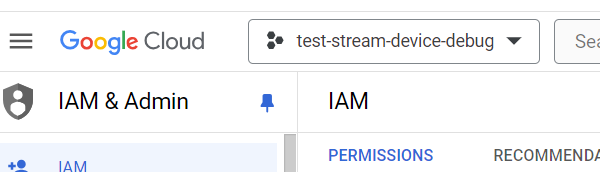
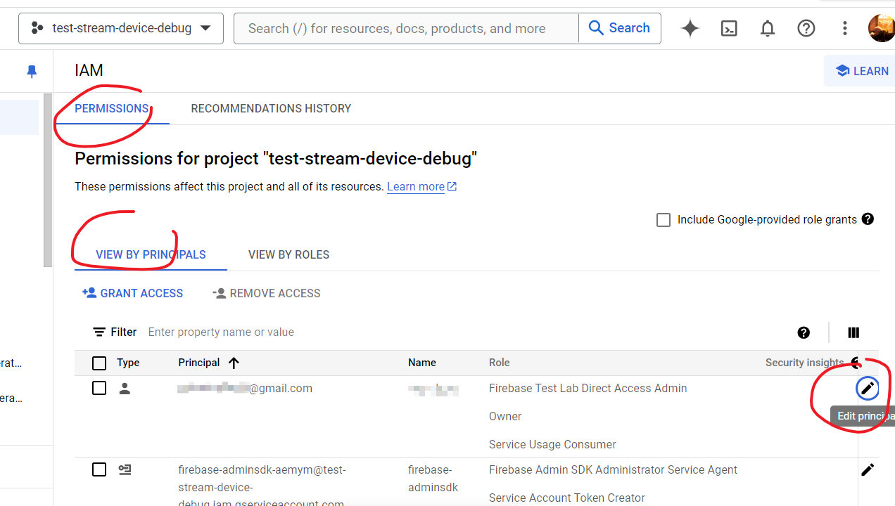

将 Android Studio 更新之后，发现更新日志里提到，可以使用设备串流进行调试了。一开始还以为是在running devices里选本地adb配对的设备然后串流画面，后来发现居然是使用firebase提供的云设备，而且有免费额度可以使用。

相关链接
- [官网介绍](https://developer.android.com/studio/run/android-device-streaming)
- [firebase项目控制台](https://console.firebase.google.com/?hl=zh-cn&pli=1)

收费的价格：https://d.android.com/r/studio-ui/device-streaming/pricing

但是由于目前还在试运行，所以这个价格和免费额度标的乱七八糟的。目前免费额度的情况好像是默认一次运行最多15分钟，然后除非手动延长，否则会关闭该设备并清除数据。一天最多90分钟。

经过测试，发现架构是arm64的，并非本地虚拟机那种x86_64

**使用步骤**
1. device manager那里，左上角有个黄色的firebase图标，点开。登录谷歌账号，授权firebase。

2. 需要有个firebase项目，https://console.firebase.google.com/?hl=zh-cn&pli=1，在firebase控制台创建一个。然后等待一会，重新打开as里的黄色图标。选择项目

3. 等待设备加载出来之后，勾选一个，点确定，然后启动设备。

连不上。。

再次打开streaming，说我firebase项目有权限错误

参考[文档](https://developer.android.com/studio/run/android-device-streaming#permissions) 尝试解决
1. 进入谷歌IAM https://console.cloud.google.com/iam-admin

2. 顶部选择自己的项目

3. 编辑自己的权限，根据文档，添加两个role

还是连不上，点查看日志，打开日志文件夹有个windows报错ShowLogs未找到。然后回到as发现右下角也有这个报错提示，有个fix按钮点一下弹出对话框，不知道是配置啥的（网页相关？）啥也没改关闭，重连好了。。

恩，应该是网络问题。。。偶尔会断开。代理开tun模式能好点。

体验了一下三星的OneUI6.0，嘿嘿