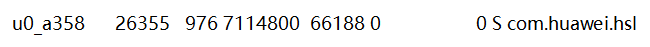

[[TOC]]

## 前言
winlator 与华为的pc应用引擎有冲突，导致启动容器时卡在加载中，只有卸载pc应用引擎，且必须重启系统，才能解决。

今天来看看到底是怎么回事，能否在不卸载pc引擎不重启系统的情况下解决。

（结果：没解决）

参考文档：

- [应用商店的pc应用引擎界面（外部浏览器无法查看）](https://appgallery.huawei.com/app/C107329145)
- [官网的pc引擎介绍](https://consumer.huawei.com/cn/support/content/zh-cn15971098/)

- [搭载HarmonyOS 3的部分平板可以运行PC版的WPS Office是基于什么原理实现的？ - 初生之鸟的回答 - 知乎](https://www.zhihu.com/question/545669497/answer/2696524260)\
pc应用引擎貌似用的euleros（isula（isulad？）） 图形用的weson+xwayland 
还有lxc-start

## 与winlator冲突
安装pc应用引擎与wps pc，启动wps后，winlator卡启动中。

解决winlator卡住的办法：
- 卸载pc引擎，重启系统。\
可能需要adb才能完全卸载（虽然我这mt直接就行），可以尝试进入手机设置-应用-右上角显示系统程序，搜索pc应用引擎，点击进入详情页，右上角四个点 - 卸载更新。
- 冰箱冻结pc引擎，重启系统。

看winlator的proot终端报错，就是wine没连上xserver

但是termux+termux-x11正常，没问题。exagear的x11也没问题

## pc应用引擎
去应用商店搜pc应用引擎，可以搜到，安装后无法直接打开。需要安装wps。然后桌面会出现对应图标。

如果不点击wps的图标，此时winlator还是可以正常启动的。点击一次后就再也不行了。说明它后台进程一直在运行。

在知乎上搜到一个pc应用引擎相关的提问，这个回答看起来比较靠谱
[搭载HarmonyOS 3的部分平板可以运行PC版的WPS Office是基于什么原理实现的？ - 初生之鸟的回答 - 知乎](https://www.zhihu.com/question/545669497/answer/2696524260)
> 没错，基于华为自家的EulerOS，然后图形环境是weston+wayland+Xwayland，输入法是fcitx5（可能华为加了鸿蒙输入法的透传）

其他回答还有提到isula（类似docker），chroot的。

提取pc引擎的apk看一下，包名是`com.huawei.hsl`。mt管理器，apk提取里，属于系统应用。

发现：
- assets里塞了个linux的rootfs。主要大小都占在这了。
- 原来目前支持的应用都写在pc引擎的manifest里了。wps，cajViewer，亿图图示都有自己的activity。**所以其实所谓的安装wps过程，就是安装pc应用引擎然后创建个快捷方式？！**
- 快捷方式创建相关：com.huawei.hsl.utils.shotCutUitl，可以看看如何启动的
- ContainerManager 好像是容器管理相关，其中有调用com.huawei.hsl.isula.xxx isula就是华为的容器引擎，这个isula上面知乎里也有提到。

### 看看快捷方式
看看wps的快捷方式，内容是啥

ShortCutUtil.b中，发现查询快捷方式的连接应该是这个\
`"content://com.huawei.android.launcher.settings/favorites"`

几个用到这个uri的query

不行，需要添加权限
`<uses-permission android:name="com.huawei.android.launcher.permission.READ_SETTINGS"/>`，但是加上也没用

普通的content://com.android.launcher3.settings/favorites获取到的是null

试试[LauncherApps](https://medium.com/android-news/nhandling-shortcuts-when-building-an-android-launcher-5908d0bb50d2)。好麻烦啊要把自己的应用设置成默认桌面才能用LauncherApps。。。

### 看看activity

用adb查询activity
`adb shell dumpsys activity activities | findstr mResumedActivity`
仅显示当前在前台显示的activity

算了还是用mt的activity记录吧
先进入com.huawei.hsl.MainActivity
再进入com.huawei.hsl.window.LinuxWindowActivity

## 能否结束pc引擎进程
既然是因为有后台进程一直运行导致winlator卡住，那么能否结束进程？

查看后台运行的pc引擎进程\
`adb shell ps | findstr com.huawei.hsl`\

再查看全部运行进程，重点在pc引擎附近看看，还有哪些\
`adb shell ps`\

`adb shell ps -f | findstr lxc-start` 查看启动参数(下面$SHA256为一串校验码)\
`lxc-start -n $SHA256 -P /mnt/isula/var/lib/isulad/engines/lcr --quiet --logfile fifo:/mnt/isula/var/run/isulad/isulad_log_gather_fifo -l INFO -d --container-pidfile /mnt/isula/var/run/isulad/lcr/$SHA256/pid.file --exit-fifo /mnt/isula/var/run/isulad/lcr/$SHA256/exit_fifo --start-timeout 120`

**我去，lxc-start**的用户是root，难道真是chroot？不对，好像是一个单独的命令，比chroot更强。。。https://www.man7.org/linux/man-pages/man1/lxc-start.1.html

尝试关闭进程\
`adb shell kill -9 pid ` 或者 `adb shell am force-stop 包名`\
杀掉weston进程没用。lxc-start进程杀不掉。。。

进入应用设置界面，强行停止，可以结束com.huawei.hsl（pc应用引擎）和com.huawei.hwid（HMS Core）的相关进程，但是lcx-start的还是结束不掉。。这root谁能管得了啊。。。我严重怀疑压根没有退出的功能。。。
1. 去反编译代码里找找
	- `IsulaService.CONTAINER_CONFIG_ERROR_MESSAGE = "Failed to setup lxc, please check the config file"`, 设置lxc失败的时候的输出，可以看看这个在哪里被调用
	- `IsulaService.remove/stopContainerService` 好像是用于停止的，但好像都是用于更新时临时删除。想想也是，启动系统之后就自动启动了，肯定不会有停止的触发条件吧。
2. wps有没有退出按钮
	- 右上角有叉，点了没啥用
3. lxc的停止命令 （没root也做不到）
	- `sudo lxc-stop -n 容器名`
	- 容器内执行`poweroff`

## 关于华为的lxc、iSulad
听说安卓上lxc还要内核支持才行。

安卓文件目录`/hw_product/bin/isula/`下，
- ./lib 下，有isula.so lxc.so
- ./bin 下，有isulad

所以lxc是运行在isulad里，而非安卓里？

看看这个[关于isulad的介绍文章](https://www.openeuler.org/zh/blog/lifeng2221dd1/2020-09-14-isulad-architecture.html)

emmm文章里isulad就像docker那样用了。所以其实lxc-start是isulad内部执行的命令？

源码
https://gitee.com/openeuler/iSulad
啊这里写了，lxc为iSulad默认的runtime。
看看能不能在第三方应用使用isulad停止容器？

不行，这些的所有者都是root用户，且仅限root用户操作

## 总结
- 华为PC应用引擎使用iSulad（lxc-start）运行了一个arm linux容器。图形显示使用的是weston+xwayland。
- 由于lxc需要root权限，导致平时无法正常被结束进程。因此只有卸载才能解决与Winlator的冲突。
- 仍未知道为什么会冲突，究竟是winlator的proot中的wine连到pc引擎的xserver上然后连接失败了，还是winlator的xserver启动失败了导致proot的wine没有找到xserver而无法启动？