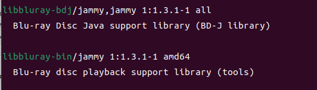

## 前言
在网上下载的蓝光盘，主要对其中的幕后花絮部分（和正片的导评音轨）感兴趣。因此需要一个菜单界面来确定每个视频及其对应的标题。

之前在windows上用的是dvd fab player。现在换到linux后，没找到能开箱即用的软件，dvdfab可以在wine里装，但是破解不生效。

经过一番搜索，发现vlc折腾一番可以支持。

版本：ubuntu 22, vlc 3.0.16

## 操作
参考
- [MakeMKV编译和安装](https://forum.makemkv.com/forum/viewtopic.php?f=3&t=224)
- https://cn.linux-console.net/?p=20242
- https://linux.cn/article-1133-1.html

> 由于在尝试的时候操作非常混乱，现在虽然成功了但不确定makemkv是否还需要。

安装并运行makemkv, 选择index.bdmv。但是选择出来的视频也没有对应标题。上面有一篇文章说有stream按钮，找不到，发现被移除了。

----
用vlc播放
1. vlc顶栏 - 媒体 - 光盘
2. 选择 蓝光
3. 点击 光盘浏览 找到对应文件夹
4. 点击 播放

报错没有java

尝试导出JAVA_HOME
`export JAVA_HOME=/usr/lib/jvm/java-11-openjdk-amd64`
还是没用。从终端打开查看如值，发现JVM found是1,usable是0


----
试试从另一条报错入手bdj.c:600: libbluray-j2se-1.3.1.jar not found.
参考 https://forum.videolan.org/viewtopic.php?t=160477

搜索依赖发现了两个没安装的（`libbluray2`安装了）bdj很可能和报错有关。




装了再试。不报错改闪退了. `LinkageError`


----
[论坛看到一个解决了的](https://forum.videolan.org/viewtopic.php?t=162509)

说是任何版本的openjdk都不行，要用oracle jdk

注册了帐号然后下载链接变404, oracle真有你的

从[华为源](https://mirrors.huaweicloud.com/java/jdk/13+33/)下了个13的 
jdk-13_linux-x64_bin.deb 
dpkg安装，然后配置
```sh
sudo update-alternatives --install /usr/bin/java java /usr/lib/jvm/jdk-13/bin/java 2
sudo update-alternatives --install /usr/bin/javac javac /usr/lib/jvm/jdk-13/bin/javac 2
sudo update-alternatives --config java
sudo update-alternatives --config javac
```

最后启动vlc之前导出java_home
`export JAVA_HOME=/usr/lib/jvm/jdk-13`

成功了！


## 总结
1. makemkv，不确定需不需要
2. 安装依赖`apt install libbluray-bdj libbluray-bin`
3. 导出java环境变量 如 `export JAVA_HOME=/usr/lib/jvm/jdk-13`。不能用openjdk，要用oracle的。
4. 不知为何从应用程序列表启动的vlc，在播放完加载界面后会自动退出。从终端输入`vlc`启动的则不会。