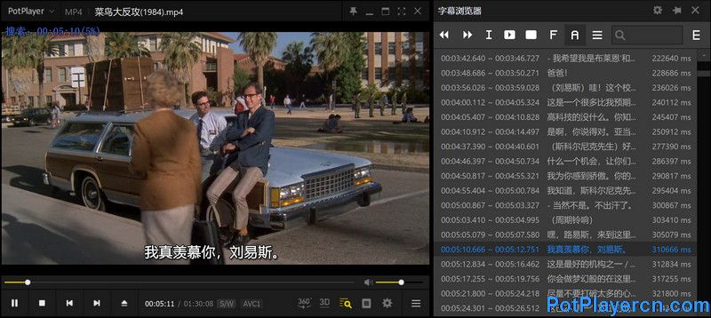

## 前言
linux上不知道有什么好的播放器，大名鼎鼎的vlc怎么连个字幕浏览器的功能都没有？？

需求:
- 视频有内封字幕时，可以查看这些字幕的全部内容。像potplayer一样

- 由于是自己用，只用支持srt格式，不支持编辑，不支持外部加载的字幕。


参考
- [比较全的vlc各种插件](https://addons.videolan.org/)：有介绍，还可以看源码，官网另一个插件页面和vlc程序内的插件页面都非常不好用
- [别人写的插件：vlsub](https://github.com/exebetche/vlsub)：可以参考怎么写的。
- [vlc的lua文档和api](https://github.com/videolan/vlc/blob/3.0.16/share/lua/README.txt)：原来文档放源码里了，官网啥都不写
- [How can I write a plugin for VLC that responds to play, pause and stop events?](https://stackoverflow.com/questions/15795385)：lua扩展的基本写法
- [一篇vlc lua扩展的教程 Extending VLC with Lua](http://www.coderholic.com/extending-vlc-with-lua/)
- [libvlc文档](https://videolan.videolan.me/vlc/group__vlc.html)
- [官方文档 Hacker Guide/How To Write a Module](https://wiki.videolan.org/Hacker_Guide/How_To_Write_a_Module/)
- 别人的插件
    - [制作gif](https://github.com/Dante383/VLC-GIF-Maker/blob/main/vlc_gif_maker.lua#L224)的扩展，用了ffmpeg
    - [听力测试填字幕](https://github.com/GDoux/Perroquet-Subtitles-for-VLC/blob/main/perroquet.lua#L734)扩展，从本地读取解析srt文件, 应该是一行一行读的
    - [另一个从本地加载字幕的](https://addons.videolan.org/p/1154027)
    - [lrcview](https://addons.videolan.org/p/1154031) lrc浏览。可以参考一下列表怎么显示的。以及一些lua自带的文件读取函数用法


版本：ubuntu22 vlc 3.0.16

吐槽：官网的wiki啥都找不到，要么就是翻源码，要么就是参考别人的lua脚本。再加上vlc的lua脚本内部代码变更非常频繁，我用的老版本很多api不一样，github上还只能搜最新版本的代码，要么就是老函数搜不到，要么就是文档里给的最新api用不了。（最后发现gitlab可以搜旧版本）

最终成果：\


## 基本
能用的api都在源码里的[lua文档](https://github.com/videolan/vlc/blob/3.0.16/share/lua/README.txt)，首先通读一遍，之后还要读很多遍。至于函数具体传参和返回值，很多只能参考具体脚本和源码。

lua脚本放在`~/.local/share/vlc/lua/extensions`目录下。要更新时到 vlc顶栏 - 工具 - 插件及扩展 - 活动插件，点击重新加载即可

3.0.16 lua值中的全局变量 vlc 的内容


### 约定回调
- function descriptor() 扩展说明和能力（接收哪些回调）
- function activate() 插件开启时。可以vlc全局变量。
- function close() 似乎是对话框关闭时调用。我看有显示对话框的都这么写
    ```lua
    function close()
    vlc.deactivate()
    end
    ```
- function playing_changed() 需要开启能力 playing-listener 。播放状态发生变化时，例如开始播放，暂停等，被调用。
- function input_changed() 需要开启能力 input-listener。

### 日志输出（vlc.msg.dbg()

vlc顶栏 - 工具 - 消息，level设为2（debug），filter输入lua

### 获取当前播放媒体

此版本没有`vlc.player`。查看3.0.16源码发现用的是
1. `vlc.playlist.current()` 获取当前播放序号
2. `vlc.playlist.get(序号)` 获取当前播放的媒体
3. `vlc.playlist.get(序号).item`

    

item的内容对应vlc顶栏 - 工具 - 媒体信息 
- `metas()` 对应元数据tab下的内容
- `info()` 对应 编解码器 tab下的内容
- `stats()` 对应统计

其中info()可以查看到视频流,音频流,字幕流,但输出是按语言来的,即我这里是中文.


### 执行终端命令

`os.execute()`

vlc提供的功能太有限，做不到/找不到的就依靠外部程序来实现


### var

vlc.var.get()
- 从vlc object中获取一个数据（比如字幕信息strack就是`get(vlc.object.input(), 'spu-es')`）

- 可用的vlc object都在vlc.object里，有 libvlc()，input()，aout()，vout()，playlist()，find()

看源码中，var_Create() var_Change()等c函数就是操作这些var的名称和内容的，不是为lua特别准备的，反过来说vlc.var.get()就是给lua提供的获取c代码中数据的途径


### 参考别人插件
https://addons.videolan.org/ 

除了extensions, 还有plugins，放在不同文件夹，可以用c语言，能力更强？

## 思路
- 方法一：
    1. 获取vlc内部解析好的字幕文本内容。
    2. 显示到屏幕上。
- 方法二：
    1. 使用外部ffmpeg 提取视频内封字幕到本地。
    2. 读取提取出的字幕文件并显示。

## 方法一（失败）
对于方法一，lua脚本提供的函数功能实在有限。唯一有点希望的是
- vlc.var.libvlc_command()
- vlc.object.libvlc()
- vlc.var.get()

但是也没找到能获取字幕流数据的方法。最接近的只是获取字幕流名称和序号，没有具体内容文本。

----
有个叫demux的模块，用于提取轨道，
[ParseSubRip](https://github.com/videolan/vlc/blob/3.0.16/modules/demux/subtitle.c#L1168) 这个c函数名字非常直观地表明了它是用来处理srt格式字幕的，但是没找到lua怎么用。

----
libvlc的参数，貌似可以从终端进入`vlc --intf rc` 然后输入help查看`cli命令`
- `strack` 查看字幕轨道信息，后面加序号就是切换到某个轨道的字幕
- `info` 显示全部信息，也包括字幕信息
- `vlm` 加载vlm。加载后再输入help会多显示`vlm命令`
	

----
strack为啥在lua扩展里 传入libvlc_command()，提示找不到此命令呢？
看一下源码里怎么用的。最新源码直接用vlc.player.get_spu_tracks()了，但是旧版没这个,用的是vlc.var.get()和get_list() [参考intf的cli中的strack](https://github.com/videolan/vlc/blob/3.0.16/share/lua/intf/cli.lua#L613)
```lua
  local input = vlc.object.input()
  local curr_sub_id = vlc.var.get(input, 'spu-es')
  local sub_list_ids, sub_list_names =  vlc.var.get_list(input, 'spu-es')
  log('尝试spu-es ' .. curr_sub_id)
  log('尝试全部spu-es ')
  for i in ipairs(sub_list_ids) do
    local id = sub_list_ids[i]
    local sub_name = sub_list_names[i]
    local mark = (id == curr_sub_id) and " *" or ""
    log(" "..tostring(id).." - "..tostring(sub_name)..mark)
  end
```
- `get(input, 'spu-es')` 获取当前选中的字幕轨道编号
- `.get_list(input, 'spu-es')` 获取全部可用的字幕轨道编号和显示名称
- 轨道编号应该是和ffmpeg查看时的一样的
- 禁用字幕轨道的序号是-1,这个可以排除掉

## 方法二（不完美）
使用外部ffmpeg提取srt字幕。lua貌似没法从命令行直接接收字符串，要写入文件再读取。可以参考其他人的插件是怎么写的。

整体逻辑：
1. 从vlc对象中获取当前播放视频的uri，用于后续作为ffmpeg的输入。
2. ffprobe读取视频中全部字幕的流序号。
3. 根据流序号，从vlc对象中获取其应显示的名称，显示到屏幕上以供用户选择，将包含序号和名称的字幕流对象存入数组。
4. 当用户选择某条字幕流时，使用ffmpeg提取该视频中对应（字幕）流，输出到本地文件。
5. 读取本地文件内容，显示到屏幕上，同时将文本存入字幕流对象。


### ffmpeg读取及提取
使用ffmpeg吧

**读取全部字幕信息**

`ffprobe -i 1.mkv -show_streams -select_streams s -v quiet  -print_format json`
- `-show_streams` 显示 流 的信息
- `-v quiet` 屏蔽开头的一大串基本信息输出
- `-select_streams s` stream specifier，s代表筛选出字幕流。和`-show_streams`搭配使用。
- `-print_format json` 输出格式为json。vlc lua中可以用dkjson模块读取json

json格式下，转为lua对象之后，筛选留下 `stream.codec_type == 'subtitle'` 并且 `stream.codec_name == 'subrip'` 的。也就是仅支持srt字幕。

----
**提取srt字幕**

`ffmpeg -y -i 1.mkv -map 0:3 output.srt` 
- `-y` 无需手动确认（比如同名文件存在时直接覆盖）
- `-map` 指定要提取哪些流。 
- `0:3` 
    - `0`表示输入序号，即-i中的第一个输入 1.mkv
    - `3`表示第三个流，这个序号在查看信息时会看到
- `0:s:1` 也可以写成这样。中间的s表示筛选字幕类型。同理还可以有 `v`视频，`a`音频。然后`1`表示字幕流中的第二个流，注意这个是只剩下字幕流后的顺序，所以和不用`s`时的序号不同。


srt文件格式非常简单，每一条字幕就是一个块，每个块之间用一个空行分隔，每个块的内容
- 第一行是一个序号，递增。
- 第二行是时间 `时:分:秒,毫秒 --> 时:分:秒,毫秒`
- 第三行往后是文本内容。


### vlc 对话框
参考lua的readme和其他插件就行了。基本逻辑就是创建一个dialog对象，然后拿这个dialog去创建各种控件。

控件可以set和get，用于更新显示，和用户交互时获取用户输入/选择。

比较迷惑的是控件的大小，创建的时候可以选填各种数据：第几列，第几行，占几列(span)，占几行，宽像素，高像素。
- 绝对像素值不生效，而宽高span这种相对值，默认显示出来不是正确比例，需要手动把对话框拉伸大到一定程度才是正确比例。比如横向两个文本宽的比例是3:1，显示出来就是1:1，但是拉伸对话框后第一个文本会一直变宽到3:1。
- 经过一番测试，横向可以用按钮占位，因为按钮有最小宽度要求，可以保证一定宽度。竖向可以用html或list占位，或者多添加几个按钮应该也行。

关于字幕的全部文本行显示，一开始用的是list，后来改成html了。用`<table>`直接显示表格。

### lua模块加载
哪些模块能加载哪些不能？
- [extension.c](https://github.com/videolan/vlc/blob/3.0.16/modules/lua/extension.c#L869)中，貌似只有zip类型才能有调用系统module, 否则只能调用同目录下自己写的
- 发现可以引入dkjson模块。这样ffprobe读取字幕流信息时可以输出成json格式了
	
    `local dkjson = require("dkjson")`
	
    为什么能用这个模块，是因为在[makefile](https://github.com/videolan/vlc/blob/a187304c75176bd5c76427d3360378111f49abf7/share/Makefile.am#L21)里有声明？

### lua基本语法
第一次接触lua，一些需要注意的地方（其实不会的问gpt就行了）

- 比较：`==` 相等，字符串比较可以用。 `~=` 不等。

- 函数返回 可以返回多个变量，因此接收函数返回值时也可以一行声明多个变量

- 
    ```lua
    for xxx do
    end

    if xxx then
    elseif xxx then
    end
    ```

- 遍历表格：`for key, value in pairs(tbl) do`
- 遍历数组（表格）：`for idx, val in ipairs(list) do`
    
    数组添加元素：`table.insert(tbl, val)`

- 函数调用：`a:b(...)` 等于 `a.b(a, ...)`

- 打印表全部内容

    ```lua
    function print_table(table)
    for key, value in pairs(table) do
        log(key .. " (" .. type(value) .. ")")
    end
    end
    ```
### 最终成果


[脚本内容](https://gist.github.com/ewt45/551118ead9dacd610ad3db2c0de9ecff)（仅测试于vlc3.0.16, 现在3.0.21或者4.0不支持了）

