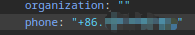
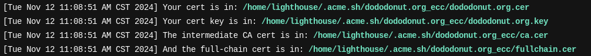

## 腾讯云
双十一，买了99一年的轻量应用服务器


记录一下入口：\
顶端 - 产品 - 云服务器\
https://cloud.tencent.com/product/cvm \
往下滑一点，上云精选的卡片 点击前往\
往下滑一点，同价续费 - 选择 轻量2核境外

实例创建完成后，可以使用OrcaTerm远程终端 [一键免密登录实例](https://cloud.tencent.com/document/product/1207/44642) 。

查看轻量服务器实例：
https://console.cloud.tencent.com/lighthouse/instance/index

基本使用：
在网页，服务器列表里，点登录按钮 一键登录。第三方登录要先在三个点里重置密码。
一键登录是用腾讯的orcaterm，跳转到对应的网页终端


## 域名
- [长期域名在哪里买便宜](https://www.v2ex.com/t/935577)
- [你们都在哪儿买的域名](https://www.v2ex.com/t/1066533)


买域名要填身份信息，可以用whois查任何域名的身份信息。cf好像会自动隐藏一些
> Cloudflare 将删除发送到此域的 WHOIS 记录的所有个人信息。

[whois的说明](https://whois.is/blog/cloudflare-whois-privacy/). 好像是说在cf买的域名自动包含隐私服务。
> Cloudflare WHOIS privacy is included for free with domain registrations through their registrar. Traditional domain privacy often incurs an additional annual fee.

在cloudflare买, 用paypal付款，出现报错 
> 很抱歉，设置时出现错误。


[参考](https://www.v2ex.com/t/762407), 如果f12看到422报错，把手机号的小数点去掉。
post时确实有个小数点,但表单里没有，应该不影响吧


其他还有说网络不要开代理 / 等几天再试 / paypal转美区 / 换信用卡 / 银联借记卡 开通网上银行和境外支付 / paypal
- [CloudFlare 付款的正确姿势是什么?](https://www.v2ex.com/t/914985)
- [cloudflare 买域名付款，总是不成功怎么办？](https://www.v2ex.com/t/1013585)
- [Paypal所谓的支持银联借记卡，实际只能绑定，支付时还是会出问题导致付款失败?](https://www.zhihu.com/question/350802951)

尝试改了一堆paypal和银联卡的设置，都没有任何卵用。

最后换了namesilo.com，直接支付宝啥也不用操心。。。

域名：dododonut.org

然后去腾讯云实例 - 域名解析


提示未生效。点击跳转到 [云解析DNS](https://console.cloud.tencent.com/cns)


发现当前域名的dns服务器是namesilo给的默认的，需要去namesilo里，把这个域名的dns服务器[改成腾讯云提供的](https://cloud.tencent.com/document/product/302/105673) （namesilo里这个叫name server....）

一些名词概念的解释：[DNS-和-Nameserver-的区别](https://yoncise.com/2013/07/03/DNS-和-Nameserver-的区别/)

然后等几个小时或者几天，可以通过 `ping 域名` 来检查dns服务器是否生效。ip显示为服务器ip就是生效了。

突然发现还有一种方法是修改dns record，直接填ip就行。两者同时修改时 只有dns服务器生效 https://www.1deng.me/namesilo-dns.html


## flask web服务器
> python用自带的模块运行web服务器(http)：
进入网站根目录，运行`python -m http.server 端口号`\
需要点进实例，防火墙添加端口号 设置为允许，就能用公网ip+端口访问了。


flask是个py模块，可以用来编写网页
flask提供的web服务器能力有限，开发时可以，但生产环境下部署时用WSGI服务器，如gunicorn。
然后再加一层nginx用于反代，顺便配置ssl证书（https）


[部署](https://flask.palletsprojects.com/en/stable/deploying/)：自己托管：wsgi服务器+nginx，或其他托管平台
- [Gunicorn](https://flask.palletsprojects.com/en/stable/deploying/gunicorn/)
- [nginx](https://flask.palletsprojects.com/en/stable/deploying/nginx/)
- [使用 Nginx 和 Gunicorn 部署 Flask 项目详细教程](https://blog.csdn.net/zybsjn/article/details/142672298)
- [How to Host a Flask Server With Gunicorn and HTTPS](https://dev.to/chand1012/how-to-host-a-flask-server-with-gunicorn-and-https-942)


安装
```sh
# 首先创建venv
sudo apt install python3.12-venv
python3 -m venv ~/py_venv

# 执行activate，进入venv
source ~/py_venv/bin/activate

# 安装flask
pip install flask
```

创建`app.py`
```python
from flask import Flask

app = Flask(__name__)

@app.route("/")
def hello_world():
    return "<p>Hello, World!</p>"
```

运行flask
- `flask [--app name] run --port 3498 --host=0.0.0.0`
- 如果文件名叫app.py，可以省略`--app 文件名`
- 端口号默认5000,这里改成自己的。
- host默认是127.0.0.1,即只允许本地。改成0.0.0.0允许从外部访问。

ok了，http的可以访问了

## gunicorn
[guinicorn文档](https://docs.gunicorn.org/)
[flask上的教程](https://flask.palletsprojects.com/en/stable/deploying/gunicorn/)

### 安装
`pip install gunicorn`
如果要使用异步workers需要安装
`eventlet`或`gevent`

### 手动运行（http+ip访问）
`gunicorn -w 3 -b 0.0.0.0:3498 app:app`

- `-w` 表示使用几个工作线程。推荐个数为cpu核心*2
- `-b` 绑定host和端口
- `{module_import}:{app_variable}` 这里第一个app代表模块名，我这里文件名为`app.py`所以模块名就是app，第二个app代表Flask实例名，即app.py中有代码`app = Flask(__name__)`
- 因为不是把`app.py`当作模块而非直接运行，所以在main里的app.run的配置不会生效。

### 配置开机自动运行（systemd）
使用systemd

创建配置文件
`/etc/systemd/system/gunicorn.service`

```ini
[Unit]
Description=Gunicorn Flask Application
After=network.target
After=systemd-user-sessions.service
After=network-online.target

[Service]
User=lighthouse
Type=simple
ExecStart=/home/lighthouse/flask/start.sh
TimeoutSec=30
Restart=on-failure
RestartSec=15
StartLimitInterval=350
StartLimitBurst=10

[Install]
WantedBy=multi-user.target
```

要执行的`/home/lighthouse/flask/start.sh` 内容如下。给予执行权限`chmod +x`
```sh
#!/bin/bash
HOME=/home/lighthouse
echo 'Starting gunicorn Flask app (systemd).'
source $HOME/py_venv/bin/activate
cd $HOME/flask
gunicorn -w 3 -b 127.0.0.1:3500 app:app
```
- 启动应该仅限本地且端口禁止外部访问，因为待会要用nginx反代，外部访问应该都走nginx。
- 端口号用3500吧

设置开机自启
`sudo systemctl enable gunicorn`\
其他参数：`start`：启动，`stop`：停止，`status`：查看当前状态。

### 手动重启（调试）
[gunicorn重新加载配置和应用](https://cloud.tencent.com/developer/article/1493641)

修改flask的py代码后，需要重启gunicorn服务器，命令：
`pstree -ap | grep gunicorn | tr -d '\n' | awk -F, '{print $2}' | awk '{print $1}'  | xargs kill -HUP`
- 前两个获取gunicorn的主进程和工作进程。
- 然后删去换行（因为awk会按行分别处理）
- 然后awk截取逗号后，空格前的内容
- 最后执行`kill -HUP 主进程id` 重启gunicorn


## nginx (http)
nginx连通80/443端口，外部访问时访问到nginx，nginx再转发到gunicorn运行的端口，起到反向代理的作用

参考
- nginx.org(免费版)
- nginx.com(商业版)
- 更多示例参考 `/usr/share/doc/nginx-doc/examples/`

安装
`sudo apt install nginx`

删掉`/etc/nginx/sites-enabled/default` 
(`sites-enabled`里的配置是从 `site-available` 链接过来的，只有`enabled`中的会生效。)

新建`/etc/nginx/sites-available/flask_gunicorn.conf`（然后再建立一个到sites-enabled的软链接）
```conf
server {
    listen 80;
    listen [::]:80;
    server_name _;
    access_log /var/log/nginx/flask_gunicorn-access.log;
    error_log /var/log/nginx/flask_gunicorn-error.log;

    location / {
                proxy_set_header X-Real-IP $remote_addr;
                proxy_set_header HOST $http_host;
                proxy_pass http://127.0.0.1:3500;
                proxy_redirect off;
    }
}
```
- 这里端口号要和gunicorn设定的对应上

重启nginx
`sudo systemctl restart nginx`


此时可以通过http访问。但是如果想使用https，需要先申请ssl证书

## https, ssl证书
- [ssl检测评估网站](https://www.ssllabs.com/ssltest/index.html)
- [腾讯云的ssl证书](https://console.cloud.tencent.com/ssl)

免费证书只能一次3个月,只能绑定域名不能绑ip。。。。

注册好域名了。
[acme.sh](https://github.com/acmesh-official/acme.sh) 这个似乎可以自动部署和更新（后悔了，麻烦的一批，各种权限不足。下次试试certbot）

### 自签名证书
先尝试一下不安全的自签名证书。使用这个，浏览器会提示不安全，最好不要访问。

1. 使用OpenSSL创建自签名SSL证书
	1. 生成私钥和证书签名请求 (CSR)：
	`openssl req -new -newkey rsa:2048 -nodes -keyout key.pem -out csr.pem`
	2. 生成自签名的SSL证书：
	`openssl x509 -req -days 365 -in csr.pem -signkey key.pem -out cert.pem`
	这会生成一个有效期为365天的证书 cert.pem，和一个私钥 key.pem。
2. 使用Flask启动HTTPS服务器
	`app.run(ssl_context=('cert.pem', 'key.pem'), host="0.0.0.0", port=443)`


### acme.sh
[中文教程](https://github.com/acmesh-official/acme.sh/wiki/%E8%AF%B4%E6%98%8E)

#### 安装

安装依赖 `apt install ca-certificates`

安装
`curl https://get.acme.sh | sh -s email=my@example.com`
- 脚本存放在 `~/.acme.sh`目录下
- 自动创建 cronjob, 每天 0:00 点自动更新有需要更新的证书


#### 生成证书
一般有两种方式验证: http 和 dns 验证.

acme.sh脚本默认ca服务器是zerossl，经常出错，卡在 `Pending, The CA is processing your order, please just wait.` \
**最好改成 letsencrypt** 
`acme.sh --set-default-ca --server letsencrypt`

----
http验证：
http 方式需要在你的网站根目录下放置一个文件, 来验证你的域名所有权,完成验证. 然后就可以生成证书了.
`acme.sh --issue -d dododonut.org -d www.dododonut.org --webroot ~/webroot/`


不太懂啊，要不要先启动一个http服务器？端口号要用啥啊？？
算了试试standalone模式

----
如果你还没有运行任何 web 服务, 80 端口是空闲的, 那么 acme.sh 还能假装自己是一个webserver, 临时听在80 端口, 完成验证:\
`apt install socat # 安装依赖`\
`acme.sh --issue -d dododonut.org -d www.dododonut.org --standalone`

提示绑定80端口权限拒绝，请尝试root权限。真用了又提示别用root。\
参考[github上的issue](https://github.com/acmesh-official/acme.sh/issues/2622), 原因是[非root用户默认不能使用1024以下端口](https://www.cnblogs.com/chenjunjie12321/p/9226279.html)

```sh
# 允许某程序绑定1024以下端口(不能是软链接所以要用socat1)
sudo setcap 'cap_net_bind_service=+ep' /usr/bin/socat1
# 清除能力
sudo setcap -r /usr/bin/socat
```

等几个pending之后就好了。




#### 安装证书
nginx示例

将证书导出到指定路径，并配置证书更新后的执行命令
```sh
acme.sh --install-cert -d dododonut.org -d www.dododonut.org \
--key-file       /home/lighthouse/flask/ssl/dododonut.org.key  \
--fullchain-file /home/lighthouse/flask/ssl/dododonut.org.crt \
--reloadcmd      "sudo service nginx force-reload"
```
- `key`是私钥，`fullchain`是证书（完整证书链）
- `reloadcmd` 指定证书更新后的执行命令
- 因为普通用户所以没法把证书安装到`/etc/ssl`下。好在reloadcmd可以用sudo


生成DH参数文件 提高安全性
`openssl dhparam -out /home/lighthouse/flask/ssl/dhparam.pem 2048`


修改nginx配置文件`/etc/nginx/sites-available/flask_gunicorn.conf`
```nginx
server {
    listen 80;
    listen [::]:80;
    server_name dododonut.org www.dododonut.org;

    return 301 https://$server_name$request_uri;
}

server {
    listen 443 ssl;
    listen [::]:443 ssl;
    server_name dododonut.org www.dododonut.org;
        
    # 指定 SSL 证书和私钥文件
    ssl_certificate /home/lighthouse/flask/ssl/dododonut.org.crt;
    ssl_certificate_key /home/lighthouse/flask/ssl/dododonut.org.key;

    ssl_dhparam /home/lighthouse/flask/ssl/dhparam.pem;
        
    # HTTP 头配置（提升安全性）
    add_header Strict-Transport-Security "max-age=31536000; includeSubDomains; preload" always;  # HSTS（强制 HTTPS）
    add_header X-Frame-Options "DENY" always;
    add_header X-XSS-Protection "1; mode=block" always;
    add_header X-Content-Type-Options "nosniff" always;
        
    location / {
        proxy_set_header X-Real-IP $remote_addr;
        proxy_set_header HOST $http_host;
        proxy_pass http://127.0.0.1:3500;
        proxy_redirect off;
    }
}

```
- 重定向http到https。301永久重定向 302临时重定向
- 添加ssl证书和DH参数的路径
- [http响应头安全策略（nginx版）](https://blog.csdn.net/liulangdewoniu/article/details/116459468)

重启nginx\
`sudo service nginx force-reload`\
或\
`sudo systemctl restart nginx` （restart和reload不确定用哪个）

重启失败，报错
```
Job for nginx.service failed because the control process exited with error code.
See "systemctl status nginx.service" and "journalctl -xeu nginx.service" for details.
```
然而通过systemd启动的服务，根据提示却找不到报错日志。

手动启动来排查错误
```
sudo nginx -t # 检查配置文件
sudo nginx -s reload # 重新加载配置文件
```
注意这里配置文件指的是nginx.conf而非 某网站的配置。\
不过reload的时候也读取了我的网站配置，报错提示密钥路径不存在。改正后再次启动，没问题了。


## vscode远程访问文件夹
- 安装插件 [Remote - SSH](https://marketplace.visualstudio.com/items?itemName=ms-vscode-remote.remote-ssh)
- 参考[插件教程](https://aka.ms/vscode-remote/ssh/tutorial)

服务器系统: ubuntu24

本机：ubuntu22

### 安装依赖
服务器：`sudo apt install openssh-server`

本机：`sudo apt install openssh-client`

### 生成密钥（本机
`ssh-keygen -t ed25519`

没填密码。公钥文件默认保存在 `用户目录/.ssh`

### 公钥上传到服务器
进入[轻量云 SSH密钥](https://console.cloud.tencent.com/lighthouse/sshkey/index) - 创建密钥 - 使用已有公钥
填写刚才生成的pub文件内容，然后绑定实例。\
这种方式会绑定到ubuntu用户，ssh也只能登录这个用户。

手动绑定到lighthouse用户：\
创建`/home/lighthouse/.ssh/authorized_keys` 并填入公钥内容。


### vscode连接
本机打开vscode，点击左下角的两个箭头 - 连接到主机 输入 `lighthouse@服务器公网ip` \
连接后，左下角会显示已连接到的ip，点击可以断开连接。 终端、打开文件夹 会访问服务器上的。

vscode左侧有远程资源管理器，可以保存配置。


选择一个配置文件后，还是输入用户名和ip\
鼠标点击箭头即可连接，列表中还会显示最近打开过的文件夹


