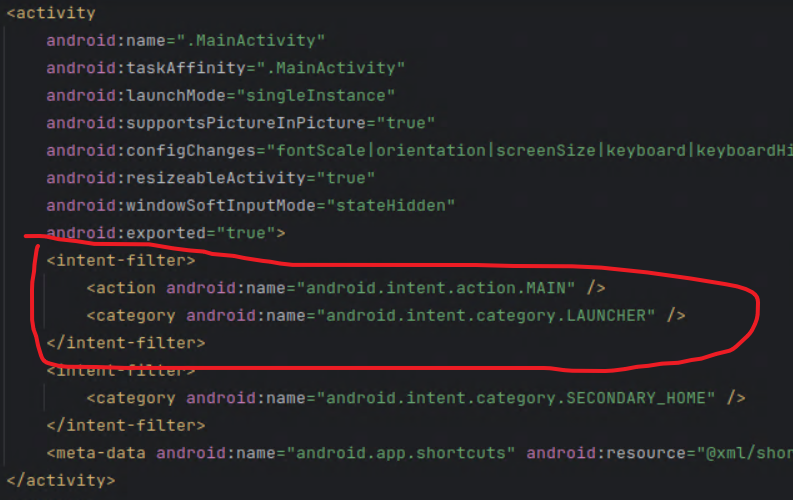
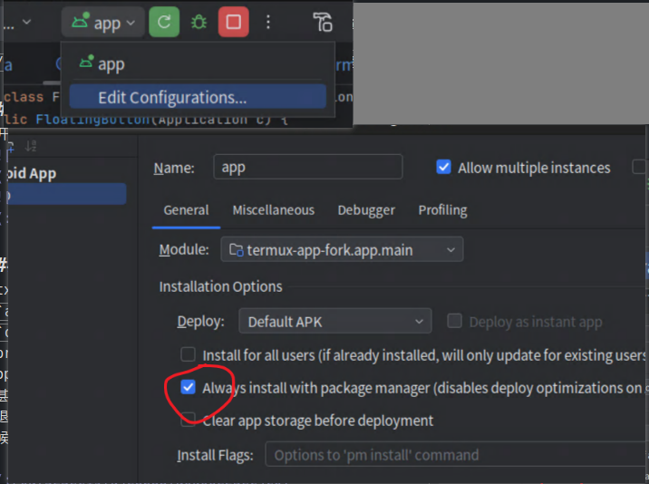

[[TOC]]

## 前言
termux-app（以下可能简称tapp）: 终端模拟器，提供一个类似linux的环境。

termux-x11（以下可能简称tx11）: linux应用如果带图形界面，则需要借助x11显示出来。

运行gui应用是很常见的需求，所以不如直接将二者合为一个。

---
**主要思路**：
1. 将termux-x11编译为aar依赖库。
2. temrux-app中导入tx11依赖库，并处理冲突
3. tapp中，添加一个悬浮球显示，用于切换tx11和tapp.

相比于tapp,tx11的代码量明显要小的多，所以考虑将tx11移植到tapp内，而不是tapp移植到tx11内。对tx11做最小改动后，打包成单个依赖库文件方便使用，然后再对tapp添加一些代码，实现一个悬浮球，能够切换到tx11的activity。

另外，由于termux-x11需要在tapp中通过包管理器安装一个启动脚本来启动xserver. 所以这个启动脚本也需要做对应更改。

**参考**：
- [将应用模块转换为库模块](https://developer.android.com/studio/projects/android-library?hl=zh-cn#groovy)
- [AndroidManifest的合并规则](https://developer.android.com/build/manage-manifests?hl=zh-cn#groovy)

**预计效果**：
- 用户只需安装一个apk，此apk包含了tapp和tx11, bootstraps中应包含termux-x11-nightly包。
- 用户打开app后，无需做任何额外操作，即可正常使用termux-x11，并从终端和图形二者的activity之间切换。

---
**成品测试**：

https://github.com/ewt45/termux-app-fork/releases/tag/20240308

*修改后的termux-x11-nightly包存于bootstraps中，只有初次安装后才会被解压，所以如果在原版app上覆盖安装 则无法生效。

## termux-x11编译为依赖库
修改源代码.

全部代码更改可以在github查看: [termux-x11-fork](https://github.com/ewt45/termux-x11-fork/tree/build-aar-to-merge-to-tapp). 以下为文字描述。

步骤：
1. app模块build.gradle 
	- 顶部 `'com.android.application'`改为`'com.android.library'` 。将应用项目改为库项目。
	- 删除 `android.defaultConfig.applicationId` 。这个只有应用项目才有。
	- `android.buildTypes.debug.postprocessing` 4个都改为false。
		- `removeUnusedResources` 为true的时候会报错 Resource shrinker cannot be used for libraries.
		- `optimizeCode` 和 `removeUnusedCode`为true的时候，会导致tapp引入aar依赖后构建时报错 java.lang.NullPointerException: Cannot invoke "com.android.tools.r8.graph.e0.J()" because the return value of "com.android.tools.r8.graph.L.b()" is null
	- (可选) `android.split.abi`中，`inlcude`只留下`arm64-v8a`
2. CmdEntryPoint. 最下面的static块中，`System.load`加载so库时会报错找不到文件``java.lang.UnsatisfiedLinkError: dlopen failed: library "/data/app/com.termux-XAoy44sazqImUbH9oFHPNQ==/base.apk!/lib/arm64-v8a/libXlorie.so" not found``，
	- 实际上是有的。猜测是tx11的so不压缩，所以可以直接从apk中加载。 参考[extractNativeLibs/useLegacyPackaging](https://developer.android.com/guide/topics/manifest/application-element?hl=zh-cn#extractNativeLibs)。但二者都改成false之后也不行。改成loadLibrary，java中调用Cmd类变正常，但终端调用termux-x11还是报错。
	- 只能改成获取解压后的文件了。在`System.load(libPath);` 前添加四行，修改libPath。
		```java
		android.content.pm.PackageInfo targetInfo = (Build.VERSION.SDK_INT <= 32) ?
			android.app.ActivityThread.getPackageManager().getPackageInfo("com.termux", android.content.pm.PackageManager.GET_SIGNATURES, 0) :
			android.app.ActivityThread.getPackageManager().getPackageInfo("com.termux", (long) android.content.pm.PackageManager.GET_SIGNATURES, 0);
		libPath = targetInfo.applicationInfo.nativeLibraryDir + "/libXlorie.so";
		```
3. LoriePreferences.java 
	- 由于库项目（应用项目不受影响）的[BuildConfig.VERSION_NAME已经被移除了](https://blog.csdn.net/qq_40533422/article/details/113446897)，所以相关代码改为从PackageManager获取
		```java
		//with("version", p -> p.setSummary(BuildConfig.VERSION_NAME));
		// 库项目的BuildConfig.VERSION_NAME已经被移除了
		try {
			String versionName = requireContext().getPackageManager().getPackageInfo(requireContext().getPackageName(), 0).versionName;
			with("version", p -> p.setSummary(versionName));
		} catch (android.content.pm.PackageManager.NameNotFoundException e) {
			throw new RuntimeException(e);
		}
		```
	- 由于gradle中代码优化相关的设置被关闭了，导致反射获取protect方法失败（优化后的smali中protect会变成public，原理未知）。搜索`"onSetInitialValue"`，删掉此行并添加
		```java
		onSetInitialValue = Preference.class.getDeclaredMethod("onSetInitialValue", boolean.class, Object.class);
		onSetInitialValue.setAccessible(true);
		```
4. 创建/res/values/public.xml，声明公开资源。没有public标签时默认导出全部资源为公共资源。所以即使没有任何公开资源也建议创建一个空的xml，将全部资源设置为私有。这里导出图标和主题。
	```xml
	<resources>
		<public name="ic_x11_icon" type="drawable" />
		<public name="AppTheme" type="style" />
	</resources>
	```

5. 修改shell-loader模块的Loader类，将读取和连接的包名改为termux的。
	- 开头添加两行。然后下面`BuildConfig.APPLICATION_ID`改为`pkgName`
		```java
		//将CmdEntryPoint里连接的应用改为termux
		String pkgName = android.system.Os.getenv("TERMUX_APP__PACKAGE_NAME");
		//将要连接的应用改为termux
		android.system.Os.setenv("TERMUX_X11_OVERRIDE_PACKAGE", pkgName, true);
		//将两个BuildConfig.APPLICATION_ID改为termux
		android.content.pm.PackageInfo targetInfo = (android.os.Build.VERSION.SDK_INT <= 32) ?
			android.app.ActivityThread.getPackageManager().getPackageInfo(pkgName, android.content.pm.PackageManager.GET_SIGNATURES, 0) :
			android.app.ActivityThread.getPackageManager().getPackageInfo(pkgName, (long) android.content.pm.PackageManager.GET_SIGNATURES, 0);
		```
	- 注释掉签名校验。下面`assert targetInfo.signatures.length == 1` 那一行注释掉。
  

6. (可选) shell-loader的gradle，包名那一行`android.defaultConfig.buildConfigField "String", "APPLICATION_ID", ` 改为termux的。但因为Loader.java里已经不用这个了所以不改也无所谓。

7. 还有好多硬编码的`com.termux.x11`包名要改成`com.termux`的。
	- 命令行修改tx11设置的 termux-x11-preference这个脚本里COMMAND中的包名，以及LoriePreference.java里要改两处说明字符串和三处intent.setPackage的包名。
	- KeyInterceptor.java 中有两处包名。

8. 构建aar。
	- gradle sync 
	- 点击 `顶端工具栏` - `Build` -` Make module 'termux-x11.app'`（好像有时候不会更新生成文件，需要点`Make Project`）
	- 构建完成后，aar文件出现在 `模块目录/build/outputs/aar`文件夹内。
9. 构建loader.apk
	- 选中shell-loader模块中的一个文件。然后Make module。会在`outputs/apk/debug`文件夹中发现apk。
    - 手动测试：重名为loader.apk，放到手机/data/data/com.termux/files/usr/libexec/termux-x11/loader.apk, 权限改为`-w` 或`400` 即可生效。（手动放很麻烦，后续改为通过deb安装）


## termux-app 导入tx11依赖
修改源代码.

全部代码更改可以在github查看: [termux-app-fork](https://github.com/ewt45/termux-app-fork/tree/built-in-tx11). 以下为文字描述。

步骤:

1. app模块的build.gradle中
	- 引入tx11的aar。根节点的 `dependencies` 添加一行`implementation files('app-debug.aar')`。然后将`app-debug.aar`放入app模块文件夹中。
	- (可选) 架构只留下arm64

2. (25.02.03) SDK相关。
	- jdk改为17（21目前不支持）。在 `File - Settings - Build,... - Build Tools - Gradle` 中修改。
	- agp改为8.x。构建时有个脱糖的任务 tx11的aar会报错。需要将android gradle plugin 升到8.x . 用 `Tools - AGP升级助手` 先升到了7,然后要手动删除三个模块里的`apply plugin: 'maven-publish'` 以及对应的`publishing`块和`task sourceJar`。然后再升到8.8.0（和termux-x11同步了）

3. 调整清单文件。引入tx11的aar后，其清单会和tapp的清单合并，需要解决冲突。[参考文档](https://developer.android.com/build/manage-manifests) 。基本思路：在tapp的清单中再次定义tx11的activity标签，然后添加或删除属性/子标签。
	- 添加MainActivity（Xrctivity也加了但是没测试）。
		- 手动指定为原来的主题。（原tx11的主题只在application那全局指定的，现在被tapp的application的theme覆盖了，红色按钮太晃眼睛）
		- 同理添加label，以便在最近任务中区分。
		- 添加`tools:node="remove"`, 移除`<intent-filter>` 的 `LAUNCHER`。否则桌面上会出现x11的图标。（注意另一个action虽然不改也要写上，否则intent-filter会匹配失败。具体可以看**清单合并 相关问题**这一章节）
		```xml
		<activity android:name="com.termux.x11.MainActivity"
			android:label="Termux:X11"
			android:theme="@style/AppTheme"
			android:exported="true">
			<intent-filter>
				<action android:name="android.intent.action.MAIN" />
				<category android:name="android.intent.category.LAUNCHER"
					tools:node="remove" />
			</intent-filter>
		</activity>
		```
	- dex的keep_processes_alive 添加`tool:replace` 保留 true（tx11是false）
		```xml
		<meta-data
			android:name="com.samsung.android.multidisplay.keep_process_alive"
			android:value="true"
			tools:replace="android:value"/>
		```
	- application标签添加`tool:replace`，以tapp的优先
		```xml
		<application
			...
			tools:replace="android:label,android:supportsRtl,android:theme">
		```

4. 项目的`gradle.properties` 
	- 最新termux已支持jdk17无需修改。 ~~在`org.gradle.jvmargs` 的参数结尾，加上空格和` --add-opens java.base/java.io=ALL-UNNAMED`。不加这个，编译会报错`Unable to make field private final java.lang.String java.io.File.path accessible: module java.base does not "opens java.io" to unnamed module @74429f70 `~~ 
	- minSdk改为26 `minSdkVersion=26`

5. **使用本地bootstrap**
	- app模块的build.gradle，下载bootstraps的那个函数调用注释掉：`variant.javaCompileProvider.get().dependsOn(downloadBootstraps)`，然后手动放好bootstrap。位置：`src/main/cpp/bootstrap-aarch64.zip`。
		- 现在已修复。~~版本用2023.11.26年的可以，最新的报错`termux-bootstrap-second-stage.sh`权限被拒绝。貌似最新的bootstrap要用0.188.1, master分支的代码落后于0.188.1的。~~
    - 或者把下载链接换成自己的，并去掉多余架构和文件校验。

6. 底部按键冲突。
 	- `termux-shared`模块 `com.termux.shared.termux.extrakeys` 包名改为`extrakeys_app`，因为tx11对此包名下的类做了修改，与tapp的同名类不再兼容。
	- `app`模块 res中`view_terminal_toolbar_extra_keys.xml`改为`view_terminal_toolbar_extra_keys_app.xml`. `view_terminal_toolbar_text_input.xml`改为`view_terminal_toolbar_text_input_app.xml`。x11中创建ExtraKeysView时用R.layout，由于xml名与tapp相同，导致获取到的是tapp的那个布局。（另外也可参考[非传递R类](https://developer.android.com/build/optimize-your-build?hl=zh-cn#use-non-transitive-r-classes)）


## 悬浮球
以下是一些实现悬浮球功能时的具体细节，有些内容可能已经过时。

**显示**

使用无需申请悬浮窗权限的类型`TYPE_APPLICATION_PANEL`。无法显示到其他应用上。必须要指定一个windowToken（`params.token = activity.getWindow().getDecorView().getWindowToken();`）

因此，使用这种类型的时候，一旦切换了activity就会丢失。需要监听activity生命周期的变化。

使用`application.registerActivityLifecycleCallbacks`
在`onActivityResumed` 判断。
- 如果进入app或x11的活动，则显示。顺便保存acitivty对象。
- 悬浮窗类型选择TYPE_APPLICATION_PANEL

在onResmue中获取的token为null，所以postDelay延迟1秒再获取。
此token貌似只能从decorView获取，windowManager.LayoutParams获取的不行。

然后在`onActivityPaused`中
- 如果是app或x11的活动，则清空先前保存的activity对象。然后移除悬浮窗。

注入代码时机就在`TermuxApplication onCreate`的时候了。

----

**窗口泄漏**

之前切换活动的时候，logcat会报错`android.view.WindowLeaked: Activity com.termux.app.TermuxActivity has leaked window android.widget.FrameLayout{50b9d55 V.E...... .......D 0,0-176,96} that was originally added here`

窗口泄露的原因：[在activity退出之后仍然没有移除窗口](https://stackoverflow.com/a/2850597/18791788)
1. 移除窗口时机不对。有时候活动退出仍未调用移除窗口代码。
	- 解决办法：在onPause回调中移除窗口。
2. 一秒内切了两次活动，导致一秒后将窗口添加到了已经退出的活动上。
	- 解决办法：在onResume回调中记录当前显示的活动。一秒后将最新显示的活动与一秒前显示的活动对比，若不等则跳过添加窗口。

----

**活动，任务，堆栈**

还有一个要考虑的，就是切一次x11活动后，终端内输入exit，app活动结束，不是退到桌面而是切回x11活动。这个怎么搞呢
- 参考: [launchmode的官方文档](https://developer.android.google.cn/guide/topics/manifest/activity-element?hl=zh-cn#lmode)
	[Android 的singleTask和singleInstance的一点思考](https://blog.csdn.net/nihaomabmt/article/details/86490090)
	
好像是一个任务就是一个栈，可以包括多个活动。如果是singleTask的话，可以在多个任务中都有一个实例（应该是跟随启动它的那个活动所在的任务）。singleInstance是所有任务中只能有一个实例。

x11活动是singleInstance app活动是singleTask。也就是说x11的活动永远是单例，app活动可能会多例？
试试清单文件中。x11的MainActivity去掉taskAffinity标签`tools:remove="android:taskAffinity"`。然后app的TermuxActivity launchmode改为singleInstance

算了先不试了。不如直接在x11切app的时候调用a.finish()结束x11活动

结束x11活动后可以了，exit退出app时不会再回到x11活动。


## 打包loader为deb/bootstraps

全部代码更改可以在github查看: [termux-packages-fork](https://github.com/ewt45/termux-packages-fork/tree/termux-x11-modified). 以下为文字描述。

### 构建deb

用termux-package的构建系统。找到`x11-packages/termux-x11-nightly/build.sh`，进行修改

```sh
TERMUX_PKG_VERSION=99.00.00
TERMUX_PKG_REVISION=1
TERMUX_PKG_SRCURL=https://github.com/ewt45/termux-x11-fork/archive/5157eeda05c66c4ab00def4e31e09150ecb87006.tar.gz
TERMUX_PKG_SHA256=50ac09363fcc74a1905a24a31588932c351a0dea83948ab3039f0128034d8506


#下面的下载链接
	local LOADER_URL="https://github.com/ewt45/termux-x11-fork/releases/download/aar-250203/termux-x11-nightly-99.00.00-any.pkg.tar.xz"

```

现在似乎loader.apk都是提前手动编译，package里直接下载预编译的apk了。所以传一个到自己仓库里。LOADER_URL对应的压缩包里的文件路径格式，参考原版tx11的就行。

本地编译太麻烦了，直接fork仓库，action里第一个，输入包名称即可构建。
输入 `termux-x11-nightly xkeyboard-config` （有个依赖）

生成deb之后，直接termux里apt或pkg安装就行了。但是手动安装deb也有点麻烦，最好直接添加到bootstraps里，这样用户安装app之后，修改过的termux-x11-nightly就自动存在了。

### bootstraps

有两个构建bootstrap的脚本
- generate-bootstraps.sh：从apt仓库直接下载deb并解压。需要提供一个apt源。termux目前官方bootstrap构建都用的这个脚本。
- build-bootstraps.sh：从本地源码开始编译出所需deb，再解压。由于是从源码编译，所以更灵活，可以手动指定包名，构建出给别的应用使用的bootstraps. 问题是这个脚本目前官方是不用的，所以年久失修，各种bug.

从去年7月一直等到现在，**build-bootstraps.sh依然没修复，凑活用吧**（吐槽：termux维护者的效率真是令人捉急。一直“预计几天” “预计几周”，结果一拖就是好几个月，tapp的版本号，tapi的更新，包括这个脚本的修复都是。真不怪原创始人突然更新谷歌版本，要真按你们的计划，都要拖到下辈子去了）

1. 新建action。仿照generate-bootstrap的workflow 改成build-bootstrap的。主要执行代码：
`./scripts/run-docker.sh  env TERMUX_PACKAGE_MANAGER=apt ./scripts/build-bootstraps.sh --architectures aarch64 --add termux-x11-nightly,xkeyboard-config`

	注意和generate的不同， `TERMUX_PACKAGE_MANAGER` 需要手动设置一下，否则app打开解压之后执行sencond-stage的时候会找不到变量而出错。

3. 修改build-bootstraps.sh
	- `PACKAGES+=("bzip2")` 改为 libbz2 。因为bzip2是libbz2的子包而非单独deb,所以搜索不到。参考issue #10462 和 #22268
	- 去掉编译时依赖。build-bootstraps会把编译时依赖也打包进去，导致压缩包有100多M。`extract_debs()` 中，新声明真正需要的变量
		```bash
	 	local real_needed_packages="termux-x11-nightly xkeyboard-config x11-repo apt bash bzip2 ca-certificates command-not-found coreutils curl dash debianutils dialog diffutils dos2unix dpkg ed findutils gawk gpgv grep gzip inetutils less libandroid-glob libandroid-selinux libandroid-support libassuan libbz2 libc++ libcap-ng libcurl libevent libgcrypt libgmp libgnutls libgpg-error libiconv libidn2 liblz4 liblzma libmd libmpfr libnettle libnghttp2 libnghttp3 libnpth libsmartcols libssh2 libtirpc libunbound libunistring lsof nano ncurses net-tools openssl patch pcre2 procps psmisc readline resolv-conf sed tar termux-am-socket termux-am termux-exec termux-keyring termux-licenses termux-tools unzip util-linux xxhash xz-utils zlib zstd "
		```
		前面几个是自己额外添加的，后面是原版termux初次安装后就有的(参考issue #23055). 注意如果中间要换行，第二行开头前不要有tab否则没有空格了导致匹配不上。反正就是别换行就行了
		
		然后在下面遍历deb的for循环中 添加一个跳过条件
		```bash
		if [[ " $real_needed_packages " == *" $current_package_name "* ]]; then
			echo "[*] Skipping build dependency package '$deb'..."
			continue
		fi
		```


测试结果：
- 如果添加了x11-repo,初次解压之后会执行它的postinit,执行`apt update` 更新索引。
- 不知为何，初次解压之后，更新索引之后还有一堆可更新的，还不是全部，版本号还没变化。似乎不更新也能用，不确定是bug还是可以忽略的问题。。
- 如果apk是从原版覆盖安装的话，也应该想办法检测一下。

## 一些遇到的问题和解决方法
### 清单合并 相关问题
应该是MainActivity的那个intentfilter导致的。自己项目的manifest中，添加tx11的activity，注释删掉那个filter
```
<activity android:name="com.termux.x11.MainActivity"
	android:exported="true">
	<intent-filter>
		<action android:name="android.intent.action.MAIN" />
		<category android:name="android.intent.category.LAUNCHER"
			tools:node="remove" />
	</intent-filter>
</activity>
```

原tx11的清单中，LAUNCHER位置如图



根据 [教程](https://developer.android.com/build/manage-manifests?hl=zh-cn#node_markers) ，可以在自己的清单里先声明一个LAUNCHER，再添上`tools:node="remove"` 来表明最终要移除这个元素。

注意，由于它在一个intent-filter里，而intent-filter又可以不唯一，**所以在自己的清单里，intent-filter其他内容必须要和tx11的一模一样。**

也就是说，虽然我们只关注LAUNCHER所在的这个category元素，但是自己清单中的intent-filter中仍然要写上action元素。否则自己写的intent-filter会被当做一个额外的元素来处理。

错误示范：
自己清单中只写了category
```xml
<activity android:name="com.termux.x11.MainActivity"
	android:exported="true">
	<intent-filter>
		<category android:name="android.intent.category.LAUNCHER"
			tools:node="remove" />
	</intent-filter>
</activity>
```
构建后，自己清单中的intent-filter被当做一个额外的filter处理，变为空元素。于此同时原tx11的清单中LAUNCHER依旧存在。从apk反编译的清单如下
```xml
<activity
	android:name="com.termux.x11.MainActivity"
	android:exported="true">
	<intent-filter />
	<intent-filter>
		<action
			android:name="android.intent.action.MAIN" />
		<category
			android:name="android.intent.category.LAUNCHER" />
	</intent-filter>
	<intent-filter>
		<category
			android:name="android.intent.category.SECONDARY_HOME" />
	</intent-filter>
	<meta-data
		android:name="android.app.shortcuts"
		android:resource="@xml/shortcuts" />
</activity>
```

可以看到自己清单中的intent-filter变为`<intent-filter />`了，说明没有与原tx11的清单中的intent-filter匹配成功。

### Run app 后代码不更新
开启强制更新



### 代码优化后的反射获取
tx11的preference打不开，发现是代码中反射获取了`androidx.preference.Preference`的一个函数`onSetInitialValue`没获取到。查看源码是有的，但是是protect。神奇的是gradle里removeUnusedCode 和 optimizeCode  设置为true，就会导致编译后变public。


### 其他 
- tx11的活动打不开了。。。。闪退，报错是
`java.lang.UnsatisfiedLinkError: dlopen failed: library "/data/app/com.termux-XAoy44sazqImUbH9oFHPNQ==/base.apk!/lib/arm64-v8a/libXlorie.so" not found`
代码是在CmdEntryPoint static块内 加载libXlorie.so时

    怪事，如果getResource找不到文件的话应该会返回null。但res不是null。libPath手动找过去也是存在的。
试试
	- 捕捉异常，让他继续往下执行试试。看看是不是搞错了？不行，后续执行native函数时找不到。
	- 猜测是打包apk时有压缩所以无法直接用压缩包内的so，改成解压后的lib路径了。

- tx11的extrakeys在termux基础上二改了，导致不兼容。只好把termux的extrakeys包名和两个xml重命名一下了。

- 发现了一个注册返回键监听的回调`activity.getOnBackPressedDispatcher().addCallback` 可惜activity的onBackPressed没调用super的话还是用不了。

## 之后更新tx11时要注意
- `com.termux.shared.termux.extrakeys` 包名被改成`extrakeys_app`了。之后如果上游 这里的类有改动的话，不确定会怎么合并。最好要注意一下。 同样还有`view_terminal_toolbar_extra_keys.xml`，`view_terminal_toolbar_text_input.xml` 都是在结尾加了个`_app`


- 如果清单文件更新了的话，可能会在tapp清单合并时出现冲突或覆盖，要注意


- tapp的修改，分成两个提交吧。第一个是普通，第二个是extrakeys重命名的。因为重命名会涉及到其他类中的引用，所以更可能引起冲突

	- 合并tx11(1/2) 添加tx11的aar并适配
将tx11编译为aar库，并入tapp整合为单个应用。
当后续与上游同步时，应选择rebase（即保证此commit放在所有commit的最后）。

	- 合并tx11(2/2) 重命名 冲突的extrakeys包名和两个xml
因为仅仅是简单的重命名操作，但影响了许多类（有些类的书写规范都被ide改了），所以单独放到一个commit里。
当后续与上游同步时，考虑放弃此提交，然后再手动重命名一下。
 
	- （25.02.03）现在又多了一个，将jdk改17, agp升级到8.8.0(同步tx11)
 

- tx11的deb更新时，VERSION不动，升级REVISION

## 待解决/待实现

**待解决**

- tapp项目：用file-project structure dependencies 导入aar，会发现`implementation files('termux-x11-debug.aar')`被放到了gradle根层的dependencies下，而非`android.dependencies`中。不知道这俩有什么区别

- tapp的gradle中，没有加入tx11的gradle中的依赖，也能运行。是因为代码打包到aar中了，还是tapp本身就用到了那些依赖？

- 资源合并时，tx11和tapp的mimap图标都叫ic_launcher，导致tx11的被覆盖掉了。有没有什么不用重命名的解决方法？

- tx11整合app，能不能切换的时候直接将其从最近任务中移除。。。否则貌似不会完全退出

 
- 25.02.07, 之前没注意过，现在每启动一次x11活动，就会多一个线程申请连接，logcat中`requestConnection 
com.termux    E    Connection failed: Connection refused`. 得想办法x11活动退出时彻底结束，或者不在退出时结束但是重新开始时别新建线程。 emmm单纯多几个连接的线程会不会没啥问题？测试了只要有一个连接之后其他的都不再输出log了。
   	- 有两个manifest的设置，taskAffinity和launchMode。另外每次跳转就是直接发送intent,这个是直接启动新activity还是在哪个函数里触发，还有是否受前两者控制？[文档](https://developer.android.com/guide/topics/manifest/activity-element#lmode)
  	- 一些最近任务相关的 autoRemoveFromRecents excludeFromRecents noHistory
    - 即使退出termux，logcat还是不断生成，所以tx11其实没完全断掉。。想办法断掉
 

 
- 一些函数：ActivityManager.isBackgroundRestricted() 是否可以用来检测tx11会不会冻结？ 不行 华为一直是false.
	 tAppActivity.getTaskId();  可以从活动获取taskId


---
**待实现**

- 悬浮窗按钮：点击切换活动，长按显示选项。选项添加一个：启动app时自动启动x11

- 将deb放到bootstrap的话，还要考虑用户是覆盖安装不触发bootstrap解压的情况。应该添加一个识别之类的，每次启动app的时候检查一下是否需要安装deb.