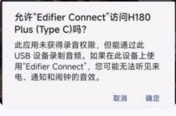
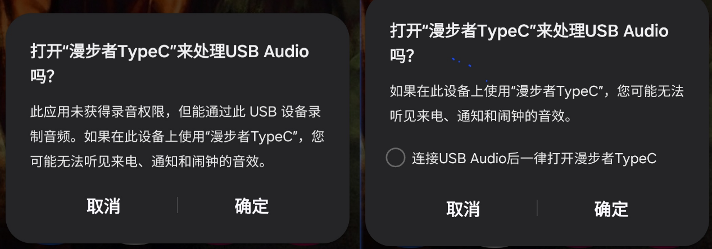
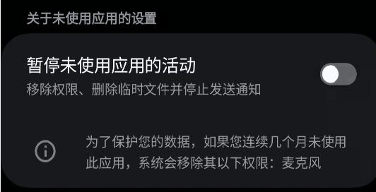

## 前言
想买个typec的有线耳机，结果坑一堆。

漫步者H180Plus(TypeC)，手机为三星s23 oneui6.1 。插上后表现为：开始播放音频时会有滴滴两声。同一个app暂停再播放，不会再次滴滴，换一个应用则会重新滴滴一次。

搜索发现网上好多人都遇到了这个问题。workaround是下载 `edifier connect` 这个app (google play 上中文名叫漫步者蓝牙连接软件，不是那个EDIFIER ConneX), 然后打开保持后台运行。每次插入耳机时，出现弹窗提示app要连接耳机，点击确认即可。

[求助，耳机发声前会有滴滴声](https://bbs-pc.edifier.com/post/34341)



不清楚原理，反正保持app在后台运行就不会出现滴滴声。也没有什么其他的好方法，那就自己写一个app简化一下流程吧。目标：应用体积尽可能小，每次插入耳机时无需手动确认。


参考
- [USB 主机概览][1]
- [选择哪种后台工作的api][2]
- [启动前台服务][3]
- [针对从后台启动前台服务的限制][4]
- [创建和管理通知渠道][5]

[1]: https://developer.android.com/develop/connectivity/usb/host?hl=zh-cn#discovering-d
[2]: https://developer.android.com/develop/background-work/background-tasks?hl=zh-cn#event-driven
[3]: https://developer.android.com/develop/background-work/services/fgs/launch?hl=zh-cn
[4]: https://developer.android.com/develop/background-work/services/fgs/restrictions-bg-start?hl=zh-cn
[5]: https://developer.android.com/develop/ui/views/notifications/channels?hl=zh-cn
## 分析 Edifier Connect

参考 `IntegratedConnector.connect()`\
先用 `UsbFindConnector` 找到漫步者设备\
然后 `UsbPermissionConnector` 检查是否有USB设备权限\
然后 `UsbConnector` 与设备连接\
最后用 `Sender` 发送了一些数据。

可以通过查看logcat看到具体发送的内容是什么
```logcat
16:57:35.060 dzq-integrated                                   V  send:[aa ec d8 00 00 6e}]main
16:57:35.073                                                  V  recv:[bb ec d8 00 13 00 00 01 00 00 01 00 00 00 01 00 01 00 01 00 00 00 00 00 97]
```
顺带一提很多日志都是中文，这app还是国人写的=-=

可以从日志中看到，向耳机发送数据后，耳机又返回了数据，至于这个返回数据有什么用就不知道了，实际也不用知道，因为后面发现只要与设备连接，不发送这串数据也没有滴滴声。

## 编写 app

### USB设备连接

USB设备的连接断开监听，发送数据等在[USB 主机概览][1]中都介绍的很详细。\
USB连接有两种，USB配件和USB主机，看起来我们需要看的USB主机的文档。

连接监听可以写在清单中，为 activity 添加 intent-filter 标签，并附加 meta-data 指定要筛选的设备。\
断开监听不能写在清单中，只能在运行时动态注册广播接收器。

连接后，先获取USB权限（通过 intent-filter 获取到的自动拥有权限）然后通过 `usbManager.openDevice()` 连接设备，接下来就可以与设备进行通信了。\
关闭连接就无法屏蔽滴滴声了，所以不需要关闭连接的代码。


### 所需权限

录音权限

注意到，连接时的弹窗，有一句“此应用未获取录音权限”（下图左）。而授予录音权限后，这句消失，并且多了一个选项“连接 xxx 设备 后一律打开 xxx app“（下图右）。如果勾选，之后插入usb设备就不会显示弹窗，而是自动打开这个app.



通知权限

为保证服务能持续运行，需要发送一个前台通知，因此需要通知权限。

关闭电池优化

目标sdk比较高的话，不允许后台运行的app启动前台服务，[除非关闭了电池优化][4]。另外也可以防止在运行中被杀死。总之开启了比较保险。

另外，长时间不使用可能导致权限被收回。最好在应用设置界面 - 权限，把对应选项关掉。


### 前台服务
插入耳机后，服务启动与持续运行的逻辑是这样的：
1. 创建一个过渡 Activity, 在清单中为其添加 intent-filter 接收 USB 设备的连接监听。
2. 耳机插入时，过渡 Activity 被调起，在 onCreate 中执行 startForegroundService 启动前台服务，然后直接 finish 结束自身。注意自身 intent 包含了 UsbDevice 的信息，所以需要将自身 intent 存入启动 Service 的 intent 的 extra 中。
3. Service 
    - 在 onCreate 中注册广播接收器，监听设备的断开。
    - 在 onStartCommand 中 取出 intent, 获取 UsbDevice 并尝试连接。如果执行成功，执行 startForeground 发送前台通知。
4. 耳机接入期间，服务一直运行（理想情况下）。
5. 如果接收到了设备断开的广播，首先确认是否是目标设备，然后 stopService 结束服务。


由于我将 app 的目标 SDK 设置为了安卓 16, 所以对于前台服务的启动要求比较严格。
- 清单中 service 标签必须要指定 foregroundServiceType 属性。这里我设置为 `android:foregroundServiceType="connectedDevice"`。
- 清单中必须声明前台服务权限，以及对应具体的前台服务类型权限
    ```xml
    <uses-permission android:name="android.permission.FOREGROUND_SERVICE" />
    <uses-permission android:name="android.permission.FOREGROUND_SERVICE_CONNECTED_DEVICE" />
    ```
- 在 activity 中启动前台服务时，执行 `startForegroundService` 而非 `startService`。然后 Service 必须在短时间内执行 `startForeground` 显示通知，否则系统会抛出异常 ForegroundServiceDidNotStartInTimeException
- startForeground 中必须指定 foregroundServiceType，需要与清单中声明的对应，否则会报错。我这里用 `ServiceInfo.FOREGROUND_SERVICE_TYPE_CONNECTED_DEVICE`。
- 发送通知需要先创建[通知渠道][5]。这部分我交给ai写的，结果不知道为什么明明是前台服务但通知也能被划掉。
- 目标sdk 安卓13开始，需要在清单中[声明通知权限](https://developer.android.google.cn/develop/ui/views/notifications/notification-permission?hl=zh-cn) `<uses-permission android:name="android.permission.POST_NOTIFICATIONS"/>`


过渡 Activity 的其他注意事项
- 它的作用是调起 Service 然后结束运行，将其主题修改为透明，这样在视觉上不会打扰用户（实际上会占用0.几秒屏幕，所以还是会小小打扰一下）。
- 在清单中为其声明 android:excludeFromRecents="true" 和 android:noHistory="true"，这样不会出现在最近应用中。
- 还需要声明 android:taskAffinity="" 否则和主 activity 一个 affinity, 启动并退出后，如果主 activity 存在就会被带起来。

### 其他
缩小 apk 构建体积，在 gradle 中添加 `isMinifyEnabled = true` 和 `isShrinkResources = true` 就行了。构建出 apk 体积 1M.

中途发现多次拔插会导致系统卡死，几十秒后自动重启（也可手动强制重启）。改了一大堆东西，也不知道哪些有效了。反正最后排查出来一个确定的是，service.onStartCommand 中如果 startForeground 无条件执行，插上就会卡死；如果仅在没有问题（不 stopSelf）的情况下 startForeground 就一切正常。

关闭电池优化，有个需要声明权限才能发送的 `Settings.ACTION_REQUEST_IGNORE_BATTERY_OPTIMIZATIONS`, 我改用不需要权限的 `Settings.ACTION_IGNORE_BATTERY_OPTIMIZATION_SETTINGS` 了。不过去应用设置 - 电池 改成 “不受限制” 也是一样的。
注意第一个 action 需要附带包名作为 uri data, 第二个 action 附带了包名反而无法启动。通过 MT 的 activity 记录 发现第二个 action 调起的 activity 为 `com.android.settings.Settings$HighPowerApplicationsActivity`，手动通过 ComponentName 启动这个 activity 也行。

安卓13的通知权限，可以通过 `Manifest.permission.POST_NOTIFICATIONS` 申请权限，然后直接出现底部弹窗，不需要跳转到设置页面。

## 最终效果
耳机插上后自动显示通知，播放音频没有滴滴声。拔出后通知关闭。


项目代码：https://github.com/ewt45/edifier-h180plus-typec-samsung\
可以在 release 下载编译后的 apk

## 待完善
- 由于默认都有USB通信权限，就没写申请USB权限的代码了。另一部分原因就是之前系统卡死也与申请权限有些神秘的联系。
- 通知抽屉里的通知图标，主体图片很小，然后周围一大圈白色背景，改了半天没改明白。Shizuku就都是蓝色的，以后有时间可以研究研究怎么改图标背景色。
