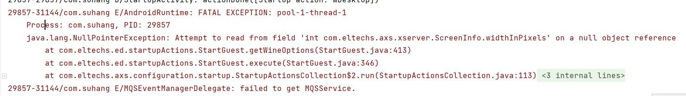

# 解决exagear内置容器，必须点开一次环境设置才能启动环境的问题

## 问题描述
- 为模拟器添加内置容器，即安装解压后，环境那一页会自动出现一个环境，可以用来制作自定义环境（比如很早之前有人就有人做过的三个内置环境分别对应三个d3d版本。但是这样做会有一个问题，就是直接点环境或者快捷方式启动会闪退，必须要进入一次环境设置（也不需要修改什么选项）。
- 点击添加环境手动创建的环境就没有这个问题。
## 出现原因
- 推测是在点击创建环境的时，调用了某个函数，而内置环境无需操作所以没有触发这个函数。
- 经hostei吧主提示，有可能是缺配置文件`shared_prefs/com.eltechs.ed.CONTAINER_CONFIG_1.xml`
1. 先使用android studio查看debug状态下的报错。如图，screenInfo这个对象没有初始化，导致读取其属性的时候出错了。关键代码在StartGuest类中的413行，使用jadx反编译即可查看。
    
2. 进入jadx，找到其所属的函数为`private static String getWineOptions(ScreenInfo screenInfo, boolean z)`,说明这个screenInfo是外部传来的，再溯源到`public void execute()`，发现传入的screenInfo是自身的成员变量，往上翻几行，发现
    ```java
    if (this.mScreenInfo != null) {
        this.mCont.mConfig.setScreenInfo(this.mScreenInfo);
    } else {
        this.mScreenInfo = this.mCont.mConfig.getScreenInfo();
    }
    ```
3. `getScreenInfo()`所属类为`com.eltechs.ed.guestContainers`，进入这个类查看，发现其成员变量有一个sharepreference，正如hostei吧主所说。类内部的函数`loadDefaults()`则在新建容器时被调用。（新建容器调用的方法为`com.eltechs.ed.guestContainers.GuestContainerConfig`类下的`createContainer()`）
    ```java
    //新建容器时，创建sharePreference文件的函数
    public void loadDefaults() {
        setName("Container_" + this.mCont.mId);
        setScreenInfoDefault();
        setLocaleName(Locales.getLocaleByDevice(this.mContext));
        setRunArguments("");
        setControls(Controls.getDefault());
        setHideTaskbarOnShortcut(false);
        setDefaultControlsNotShortcut(true);
        setDefaultResolutionNotShortcut(true);
        setStartupActions("");
        setRunGuide("");
        setRunGuideShown(false);
    }
    ```
4. 对比sharePreference，发现`loadDefaults()`就是内置环境没有调用的函数。而`createContainer()`中调用它之后也没什么其他的操作了。所以推测闪退原因就是缺少sharePreference文件。
    ```XML
    <!-- SharePreference文件内部结构 -->
    <?xml version='1.0' encoding='utf-8' standalone='yes' ?>
    <map>
        <string name="SCREEN_SIZE">1024,768</string>
        <string name="RUN_ARGUMENTS"></string>
        <boolean name="DEFAULT_CONTROLS_NOT_SHORTCUT" value="false" />
        <boolean name="DEFAULT_RESOLUTION_NOT_SHORTCUT" value="false" />
        <string name="RUN_GUIDE"></string>
        <string name="STARTUP_ACTIONS"></string>
        <string name="CONTROLS">yuhan</string>
        <string name="SCREEN_COLOR_DEPTH">32</string>
        <string name="NAME">预设容器</string>
        <boolean name="HIDE_TASKBAR_SHORTCUT" value="false" />
        <boolean name="RUN_GUIDE_SHOWN" value="false" />
    </map>
    ```


## 解决原理
- 缺失的函数为loadDefaults()，其作用为创建SharePreference文件，记录当前容器的设置信息，在创建容器时被调用。所以有两种解决方法：
    - 在初次启动时调用创建环境的代码，创建环境，这样函数就会被执行。
    - 自己写一个sharePref

- 这里选择后者。又有两种选择：
    - 在代码中调用原生方法写入sharepref，
    - 也可以提前写好xml文件放入apk，然后再代码中移动文件到对应目录。

- 我这里选择前者。其实感觉前者更方便修改一点，因为有时候需要自定义按键和分辨率。
 1. 整体思路


    ::: tip 整体思路
    - 编写java代码，测试通过后再转为smali，加入dex中
    - 新建一个类，其包含一个静态方法用于创建SharePref文件，需要传入参数context。
    - 在exagear主Activity里调用该方法，确保程序启动时即可执行。
    - 为什么要在Activity中，而不是随便一个类中调用？因为要获取SharePref文件，所以需要用到context，而context需要从activity中获得。
    :::

 2. 使用AndroidStudio编写代码，创建类ExagearPrefs。文件格式照着GuestContainerConfig写就行。最后写入文件用的是apply同步写入方法，可能造成anr，如果出现问题可以尝试换成commit异步写入。
    ```java
    package com.example.datainsert;

    import android.content.Context;
    import android.content.SharedPreferences;
    import android.util.Log;

    public class ExagearPrefs {
        static public void setSP(Context ctx){
            SharedPreferences sp = ctx.getSharedPreferences("com.eltechs.zc.CONTAINER_CONFIG_1", Context.MODE_PRIVATE);
            //如果没获取到sp就创建一个
            if(sp.getString("NAME","NAME_NOT_FOUND").equals("NAME_NOT_FOUND")){
                SharedPreferences.Editor editor = sp.edit();
    //        Log.d("ExagearPrefs", "setSP: "+sp.getString("NAME","NAME_NOT_FOUND"));
                editor.putString("SCREEN_SIZE","1024,768");
                editor.putString("SCREEN_COLOR_DEPTH","32");
                editor.putString("NAME","预设容器");
                editor.putString("RUN_ARGUMENTS","");
                editor.putString("CONTROLS","default");
                editor.putBoolean("HIDE_TASKBAR_SHORTCUT",false);
                editor.putBoolean("DEFAULT_CONTROLS_NOT_SHORTCUT",false);
                editor.putBoolean("DEFAULT_RESOLUTION_NOT_SHORTCUT",false);
                editor.putString("STARTUP_ACTIONS","");
                editor.putString("RUN_GUIDE","");
                editor.putBoolean("RUN_GUIDE_SHOWN",false);
                editor.putString("CREATED_BY","补补23456"); //用这个检测存不存在吧

                editor.apply(); //同步写入，commit是异步写入
            }else{
                Log.d("ExagearPrefs", "setSP: sp已存在，跳过写入");
            }

        }
    }
    ```
 3. 在主Activity中调用：`ExagearPrefs.setSP(getApplicationContext());`。
 4. 构建项目并在虚拟机中运行，发现可以正常创建SharePref文件。
    


 5. 使用插件将java转为smali，并导入exagear的dex。\
 ExagearPrefs类的导入：进入mt管理器的dex编辑器++，在浏览界面随便长按一个路径然后点击导入，选择smali文件导入。
    
 6. 调用ExagearPrefs代码的导入：将MainActivity也转为smali，找到调用ExgearPrefs的那一行代码。
 **注意这个代码不能直接用。第一行代码为获取`Lcom/example/datainsert/MainActivity`的Context，而在Exagear中应该获取它自己的某个Activity的context，所以我们现在需要将`Lcom/example/datainsert/MainActivity`修改为Exagear某个类的路径，然后放入这个类的OnCreate方法中（Activity生命周期从OnCreate开始）。要求为：必须是Activity，而且在Exagear启动时越早被调用越好。**
    ```smali
    #主Activity中调用函数的代码
    invoke-virtual {p0}, Lcom/example/datainsert/MainActivity;->getApplicationContext()Landroid/content/Context;

    move-result-object v1

    invoke-static {v1}, Lcom/example/datainsert/ExagearPrefs;->setSP(Landroid/content/Context;)V
    ```
7. 寻找我们需要的Activity的方法：（以暗黑直装版为例）打开mt管理器左侧栏-Activity记录，然后启动Exagear，发现第一个启动的类为EDStartupActivity，决定就是它了。所以将第一行的代码对应类名改为Lcom/eltechs/ed/activities/EDStartUpActivity，然后放入EDStartUpActivity的initialiseStartupActions()方法的结尾（恩这个类里没有OnCreate，观察它仅有的几个函数就这个最像初始化函数了）
    ```smali
    #放入EDStartupActivity中initialiseStartupActions()结尾的代码
    invoke-virtual {p0}, Lcom/eltechs/ed/activities/EDStartupActivity;->getApplicationContext()Landroid/content/Context;

    move-result-object v1

    invoke-static {v1}, Lcom/example/datainsert/ExagearPrefs;->setSP(Landroid/content/Context;)V
    ```
    

8. 重新编译dex，apk签名并重装，打开测试，发现不用点开设置也能启动内置环境了，成功。

## 解决实操
本节和 解决原理 后半部分大致相同，省略了解释原理的部分。\
整体思路：分两步，新建一个类用于创建SharePref文件，然后在主Activity中调用这个类。
1. 打开mt管理器的dex编辑器++，在浏览界面长按任意路径，导入[ExagearPrefs.smali](https://pan.baidu.com/s/12SXyCLwy80CP3c-Py0XVEw?pwd=96qs )。该smali用于生成内置环境的设置信息，说一下几个常用的：
 - 58行是分辨率，默认为default，或者其他支持的分辨率，宽高用逗号隔开
 - 65行是色深
 - 72行是环境名称
 - 86行是操作模式，默认为default，或者com.eltechs.ed.controls包里对应操作的类中getId()返回的字符串
2. 使用mt管理器左侧栏的activity记录功能，查看Exagear启动时第一个启动的Activity名字。以图中为例，第一个打开的为com.eltechs.ed.activities.EDStartupActivity
    
3. 将下面三行代码添加到刚才找到的Activity的OnCreate方法的末尾处。
 - 注意第一行代码中的com/eltechs/ed/activities/EDStartupActivity改成刚才找到的Activity名字，点.换成斜线/。
 - 我找的这个EDStartupActivity没有OnCreate，只有一个initialiseStartupActions，把它当OnCreate就行。

    invoke-virtual {p0}, Lcom/eltechs/ed/activities/EDStartupActivity;->getApplicationContext()Landroid/content/Context;

    move-result-object v1

    invoke-static {v1}, Lcom/example/datainsert/ExagearPrefs;->setSP(Landroid/content/Context;)V

4. 编译，重装，测试。

## 总结
- 解决办法就是手动添加SharePreference文件。
- 在测试过程中，发现只要生成sharePref文件并启动一次之后，就算把sharePref删掉也一样能启动。这说明exagear读取sharePref之后又生成了其他文件，第二次往后启动都依靠这个其他文件来启动了。